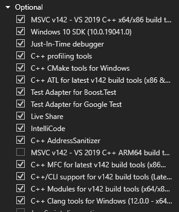
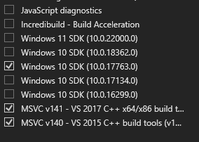

# Installing from source
This section describes how to build and install Pywr from source depending on the Operating System you are using.

## Choose the solver
When installing Pywr you must specify which solvers to build. This is done by setting the `PYWR_BUILD_GLPK` and 
`PYWR_BUILD_LPSOLVE` environment variables to either true or false before calling the `setup.py` script.

## Install the pywr dependencies
Pywr has several external dependencies which are:
 
- Core dependencies (required)
    - [Cython](http://cython.org/)
    - [NumPy](http://www.numpy.org/)
    - [NetworkX](https://networkx.github.io/)
    - [Pandas](http://pandas.pydata.org/)
    - [packaging](https://pypi.python.org/pypi/packaging)
- Linear programming solvers (at least one required)
    - [GLPK](https://www.gnu.org/software/glpk/) (recommended)
    - [lpsolve](http://lpsolve.sourceforge.net/5.5/)
- Optional dependencies (providing additional functionality)
    - [pytables](http://www.pytables.org/)
    - [xlrd](https://pypi.python.org/pypi/xlrd)
    - [pytest](http://pytest.org/latest/) (for testing only)
    - [SciPy](http://www.scipy.org/)
    - [Jupyter](https://jupyter.org/)
    - [Matplotlib](http://matplotlib.org/)

Activate your virtual environment first: 

    source myvenv/bin/activate

We recommend using [uv](https://docs.astral.sh/uv/) for package management, as it is the easiest way to install 
the dependencies. The following command will build and install Pywr with only the GLPK solver:

    PYWR_BUILD_LPSOLVE=false uv pip install -e .

If you prefer using `pip` you can simply run:

    pip install -e .

The dependencies are taken from the `pyproject.toml` file in the root folder of the repository.

!!! note "MacOS ARM"

    If you have a mac with an ARM processor, there is no compiled version for the `tables` 
    wheel. `pip` will attempt to install it from source which will likely fail. Install `hdf5`
    with brew first and then install the wheel from PyPI:

        brew install hdf5
        pip install tables

## Compile on Ubuntu
### Install the compiler
To install the GCC compiler, run the following command in the terminal:

    sudo apt install build-essential

### Download the solvers
The following commands install the GLPK and lpsolve libraries:

    sudo apt-get install libgmp3-dev libglpk-dev glpk
    sudo apt-get install liblpsolve55-dev lp-solve

The Ubuntu package for `lpsolve` includes a static library which can confuse the compiler. The easiest work-around is
to remove it:

    sudo rm /usr/lib/liblpsolve55.a
    sudo ln -s /usr/lib/lp_solve/liblpsolve55.so /usr/lib/liblpsolve55.so

### Compile pywr
To build Pywr use:

    python setup.py build_ext --inplace --verbose 

## Compile on Windows

### Install the compiler
Install the Microsoft Compiler first:

1. Install the MSVC tool and Windows Kit by running [Visual Studio Installer](https://visualstudio.microsoft.com/downloads/)
2. Tick the option below to install all the dependencies:

Copy the file `rc.exe` and `rc.dll` from `C:\Program Files (x86)\Windows Kits\10\bin\10.0.17763.0\x64` to:

- C:\Program Files (x86)\Microsoft Visual Studio 14.0\VC\bin 
- C:\Program Files (x86)\Microsoft Visual Studio\2019\Professional\VC\Tools\MSVC\14.29.30133\bin\Hostx86\x64. 

You may need to adjust the paths based on the version of the Windows Kit you installed.

### Download the solvers
TODO

### Compile pywr
To build Pywr use:

    python setup.py build_ext --inplace --verbose 

## Compile on MacOS
This section describes how to install the necessary dependencies
and compile pywr on MacOS with the `glpk` solver. If you wish 
to use `lpsolve`, you can alter the commands below. This guide also
assumes you have:

1. the [Brew package manager](https://brew.sh) already installed on your machine.
2. You have already created a [Python virtual environment](https://docs.python.org/3/tutorial/venv.html#creating-virtual-environments).
3. You have already installed the `gcc` compiler. The easiest option is to install [Apple’s XCode](https://developer.apple.com/).

### Get the solvers
The GLPK solver with the header and library files is available via `brew`, to install it run:

    brew install glpk

Obtain the path where the solver was installed using

    brew info glpk

### Compile pywr
Compile pywr using the command below. Remember to replace the path to the glpk solver

    CFLAGS="-I /opt/homebrew/Cellar/glpk/5.0/include" LDFLAGS="-L /opt/homebrew/Cellar/glpk/5.0/lib" python setup.py build_ext --inplace --verbose
  
The `-I` includes the `glpk.h` header file pywr needs, the `-L` option includes the dynamic library already compiled
for MacOS. Make sure to adjust the paths to the solvers installed by `brew` if you are using a different version.
