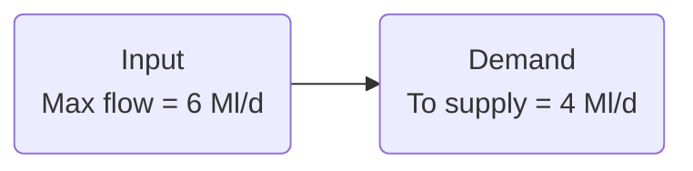
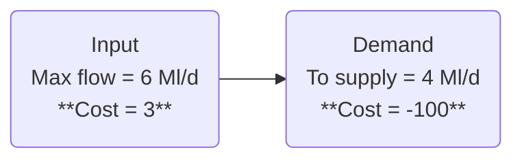
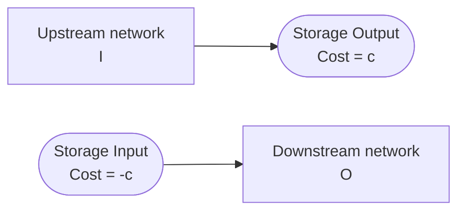
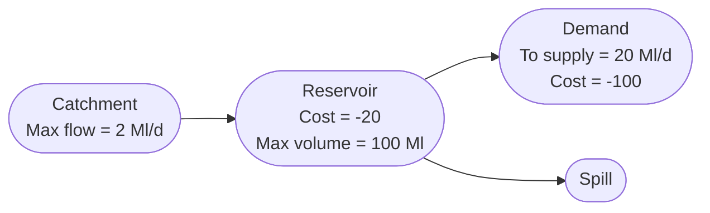
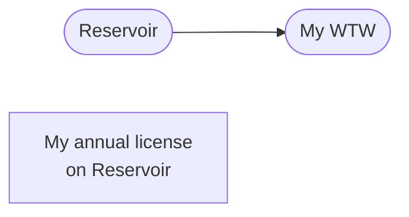
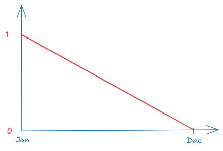
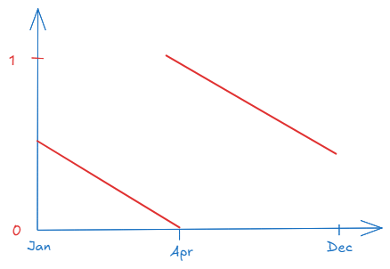

# Costs

Pywr uses synthetic costs or allocation penalties to control water allocation. In very general terms, 
the problem of routing water along a route of nodes can be expressed as:

<p style="text-align: center;"> minimise  C<sub>i</sub> * X<sub>i</sub> </p>

Where:

- C<sub>i</sub> represents the cost or penalty per unit flow at node i, and
- X<sub>i</sub> is the unknown flow that the solver must determine.

At each timestep, pywr solves the supply-demand balance problem using the [linear programming algorithm](./problem.md). 
The solver then chooses the set of flows that results in the **minimum total system cost** at each timestep, while adhering to all
physical constraints and operational rules (e.g., max and min flow on links, reservoir capacity).

In Pywr:

- Costs are not necessarily financial, but you can use operational costs as a proxy for synthetic costs to assign to assets.
- Costs can be positive or negative.
- Low costs (including negative costs) indicate preferred actions (such as meeting demand or using a preferred route to supply water).
- High costs indicate actions that should be avoided if possible. They can be used as "penalty functions" to 
strongly discourage certain actions, like violating a minimum environmental flow or letting a reservoir fall 
below a critical level.
- Costs can be constant numerical values or vary during the simulation.

Determining the costs is a critical step to ensure the model is a reasonable representation of the real-world system.
It is a modeller's responsibility to adjust the model costs so that the model's outputs match historical observations or the
expected system response. 

The following sections explain how costs generally work and how you can set them on nodes.

## A simple example

Consider the following basic model:



=== "Python"
    ```python
    from pywr.model import Model
    from pywr.nodes import Input, Output
    from pywr.timestepper import Timestepper
      
    model = Model()
    input_node = Input(model, name="Input", max_flow=6)
    demand = Output(model, name="Demand", max_flow=4)
      
    input_node.connect(demand)
      
    model.timestepper = Timestepper("2000-1-1", "2000-1-2")
    model.run()
      
    print(demand.flow)  # 0
      
    ```

=== "JSON"

    ```json
      {
        "metadata": {
            "title": "Test model",
            "minimum_version": "0.1"
        },
        "timestepper": {
            "start": "2020-01-01",
            "end": "2020-01-02",
            "timestep": 1
        },
        "nodes": [
            {
                "name": "Input",
                "type": "Input",
                "max_flow": 6
            },
            {
                "name": "Demand",
                "type": "Output",
                "max_flow": 4
            }
        ],
        "edges": [
            ["Input", "Demand"]
        ],
        "recorders": {
            "Demand recorder": {
                "type": "NumpyArrayNodeRecorder",
                "node": "Demand"
            }
        }
    }
    ```

If you run this model for one day with no costs assigned, no water will be supplied to the demand node. To make it work,
you need to assign costs to the nodes:



=== "Python"
    ```python
    from pywr.model import Model
    from pywr.nodes import Input, Output
    from pywr.timestepper import Timestepper
    
    model = Model()
    input_node = Input(model, name="Input", max_flow=6, cost=3)
    demand = Output(model, name="Demand", max_flow=4, cost=-100)
    
    input_node.connect(demand)
    
    model.timestepper = Timestepper("2000-1-1", "2000-1-2")
    model.run()
    
    print(demand.flow)  # 4
    ```

=== "JSON"

    ```json
      {
        "metadata": {
            "title": "Test model",
            "minimum_version": "0.1"
        },
        "timestepper": {
            "start": "2020-01-01",
            "end": "2020-01-02",
            "timestep": 1
        },
        "nodes": [
            {
                "name": "Input",
                "type": "Input",
                "max_flow": 6,
                "cost": 3
            },
            {
                "name": "Demand",
                "type": "Output",
                "max_flow": 4,
                "cost": -100
            }
        ],
        "edges": [
            ["Input", "Demand"]
        ],
        "recorders": {
            "Demand recorder": {
                "type": "NumpyArrayNodeRecorder",
                "node": "Demand"
            }
        }
    }
    ```

In this example:

- The input node has a positive cost (penalty for supplying water)
- The demand node has a negative cost (benefit for meeting demand)

When the benefit of meeting demand outweighs the penalty of the input, the flow in the network will occur within the
node's costs and constraints.

!!!warning "Model calibration"
    It’s the modeller’s responsibility to set appropriate costs to drive the desired system behavior.
    Usually, a range of cost values influences the model’s results, not a single fixed value.

You can set as many costs as you like in the network. If you have for example three nodes with penalties
-20, 4, 10, the first node gets water first and the last node with the highest penalty is supplied
water last. If you set the same costs on two nodes, the node that will get water first is the node that
is first defined in the model.

If you want to limit the flow for an expensive asset (such as a works or pumping station), you can set a high cost
that reflects the assets' operational costs. If you need to model a demand centre, this should have instead a negative
cost.

## Reservoirs

`Storage` or `Reservoir` nodes in Pywr also require assigned cost.These costs help balance water resources by
indicating when to conserve water versus when to rely on more expensive sources. This becomes
especially important in conjunctive systems (i.e., systems with multiple water sources). If your model has only one
reservoir, defying the cost is very straightforward: the cost should be set to tell the pywr to drawdown the reservoir
and
always meet demand.

### What does the cost control?

If you assign a cost `c` to a storage node, Pywr internally represents the reservoir as two separate nodes with opposing
costs:



Here is how it works:

- The `Storage Output` node with cost `c` is where water enters the network (from an upstream node `I`).
- The `Storage Input` node with cost `-c` is where water is released from the reservoir (to the downstream node `O`).

As you can see from the schematic, the `Storage output` and `Storage input` nodes are not connected and the reservoir
node creates a gap in the network where water can be stored over time.

The change in storage during a timestep is calculated as the difference between:

- Output flow `O` – the amount released from storage, and
- Input flow `I` – the amount entering the storage.

Pywr also ensures that this difference is not greater than the current and maximum storage volume, and not less
than the minimum allowed storage.

To properly configure the reservoir node, set:

- a positive cost to increase releases from the reservoir. This penalises increasing volume by giving a benefit
  (negative cost) to the released flow.
- a negative cost to preserve water. This penalises decreasing volume by giving a benefit to the inflow.

The following sections explain how to set the cost in more detail depending on the problem you are solving.

### Constant cost

A constant cost does not change throughout the simulation. If you have the following model, set a negative cost
on the reservoir and run the model for three days:



=== "Python"
    ```python
    from pywr.model import Model
    from pywr.nodes import Storage, Catchment, Output
    from pywr.timestepper import Timestepper
    
    model = Model()
    catchment = Catchment(model, name="Catchment", flow=2)
    storage = Storage(model, cost=-20, max_volume=100, initial_volume_pc=1, name="Storage")
    spill = Output(model, name="Spill")
    demand = Output(model, name="Demand", cost=-100, max_flow=20)
    
    catchment.connect(storage)
    storage.connect(spill)
    storage.connect(demand)
    
    model.timestepper = Timestepper("2000-1-1", "2000-1-3")
    model.run()
    
    print(storage.volume)  # 46
    ``` 

=== "JSON"

    ```json
      {
        "metadata": {
            "title": "Test model",
            "minimum_version": "0.1"
        },
        "timestepper": {
            "start": "2020-01-01",
            "end": "2020-01-03",
            "timestep": 1
        },
        "nodes": [
            {
                "name": "Catchment",
                "type": "Catchment",
                "flow": 2
            },
            {
                "name": "Storage",
                "type": "Storage",
                "max_volume": 100,
                "initial_volume_pc": 1,
                "cost": -20
            },
            {
                "name": "Spill",
                "type": "Output"
            },
            {
                "name": "Demand",
                "type": "Output",
                "max_flow": 20,
                "cost": -100
            }
        ],
        "edges": [
            ["Catchment", "Storage"]
            ["Storage", "Spill"]
            ["Storage", "Demand"]
        ],
        "recorders": {
            "Demand recorder": {
                "type": "NumpyArrayStorageRecorder",
                "node": "Storage"
            }
        }
    }
    ```

the solver will take `20` - `2` each day from the reservoir leaving 46 Ml a the end of the run.

!!!info "Cost value"
    In the example above, the cost can be any value between `0` and `-99`. As
    mentioned earlier, it is not a specific cost value that drives the model behaviour but a range. If you set the
    cost to `-100`, no water is released from the reservoir because the cost on the "Storage Input" node equals
    the cost on the demand node and therefore there is no benefit in supplying water.

If you were to set a positive cost on the storage node, the solver will empty the reservoir. The solver 
will deliver 20 Ml/d to the demand node on the first day and 80 Ml/d to the spill, leaving the reservoir always 
empty and supplying only 2 Ml/d to the demand node.

### Two set of constant costs
In a conjunctive system, where multiple sources are available, you may need to balance sources; for example if a reservoir
reaches low-storage conditions, you want the model to use a more expensive storage node when a certain storage in the
other reservoir is crossed. This can be achieved by setting a user-defined control curve on a reservoir:

- when the storage is above the control curve, Pywr will use a small cost (for example `-1`).
- when the storage is below the curve, you further decrease the cost to preserve more water (for example to `-100`).

When a reservoir crosses the control curve before another, water will be preserved. You can use the same cost 
sets on all reservoirs or different values depending on the system response you want to achieve. The storage node setup 
looks like this:

```json
{
  "type": "storage",
  "name": "My reservoir",
  "max_volume": 100,
  "initial_volume_pc": 1,
  "cost": {
    "type": "controlcurve",
    "name": "Control curve - My reservoir",
    "storage_node": "My reservoir",
    "control_curve": "Your control curve",
    "values": [-1, -100]
  }
}
```

The parameter implemented in `cost` will look at the storage in "My reservoir", compare it against the curve 
defined in the parameter named  `"Your control curve" `and assign `-1` if the storage is above the profile or `-100` 
when below. On the day the reservoir crosses the control curve, the costs changes from `-1` to `-100`, and this
allows the solver to significantly reduce the take from this source.

You can also assign more than one control curve as follows:

```json
{
  "type": "storage",
  "name": "My reservoir",
  "max_volume": 100,
  "initial_volume_pc": 1,
  "cost": {
    "type": "controlcurve",
    "storage_node": "My reservoir",
    "name": "Control curve - My reservoir",
    "control_curves": ["Control curve 1", "Control curve 2"],
    "values": [-1, -35, -100]
  }
}
```

Pywr will use `-35` as cost when the storage is between the two control curves. The number of costs is always equal
the number of control curves plus 1.


### Two interpolated costs
In the previous section, we used a control curve to set reservoir costs based on whether a storage is above or below
a defined threshold (or set of thresholds). In that approach, the cost changes abruptly when the control line is crossed and
is not affected by the storage that is actually left in the reservoir.

A more refined method is to make the reservoir cost vary continuously with the available storage by interpolating between two
or more costs. This allows the model to better balance resources as water will be preserved first in those sources 
that are more depleted and have a smaller cost.

In the following example, the cost becomes increasingly negative as the reservoir volume decreases using a [pywr.parameters.ControlCurveInterpolatedParameter][].
The configuration is very similar to the [pywr.parameters.ControlCurveParameter][], but the number of cost values you 
need to provide is equal to the number of control curves plus 2:

```json
{
  "type": "storage",
  "name": "My reservoir",
  "max_volume": 100,
  "initial_volume_pc": 1,
  "cost": {
    "type": "controlcurveinterpolated",
    "storage_node": "My reservoir",
    "control_curves": [
       {
         "type": "constant",
         "value": 0.9
       },
       {
         "type": "constant",
         "value": 0.5
       },
       {
         "type": "constant",
         "value": 0.3
       },
    ],
    "values": [-1, -5, -90, -100]
  }
}
```

The cost operates as follows:

- if the storage is between 100% and 90%, the cost is linearly interpolated between `-1` and `-5`. At 100% the cost is `-1` and at 50% `-5`.
- if the storage is between 50% and 30%, the cost is linearly interpolated between `-5` and `-90`. The cost at 50% is `-90`.
- if the storage is below 30%, the cost is interpolated between `-90` and `-100`. The cost when the storage is empty is `-100`.

### Piecewise interpolated costs
A even refined method of controlling how water is preserved, when a control curve is crossed, is by using 
the [pywr.parameters.ControlCurvePiecewiseInterpolatedParameter][]. This is similar to the previous parameter, but Pywr
interpolates between a different pair of cost values when you are above or below a control curve. 

For example:

```json
{
  "type": "storage",
  "name": "My reservoir",
  "max_volume": 100,
  "initial_volume_pc": 1,
  "cost": {
    "type": "controlcurvepiecewiseinterpolated",
    "storage_node": "My reservoir",
    "control_curves": [
       {
         "type": "constant",
         "value": 0.5
       }
    ],
    "values": [
       [-0.1, -1],
       [-100, -200]
    ]
  }
}
```

When the storage:

- is above the curve (50%), the cost in linearly interpolated between `-0.1` and `-1` based on the available storage.
- when you are below, the cost decreases considerably and is interpolated between `-100` and `-200`.


!!!info "Conjunctive system"
    If you have a conjunctive system and want to equally balance the sources, you may 
    use the [pywr.parameters.ControlCurvePiecewiseInterpolatedParameter][] on all reservoirs with a different 
    control curve but same cost pairs. 

## Annual license
If your source is constrained by an annual license, and you need to limit its daily usage because you may run out
at the end of the year, you need to set a cost that controls how Pywr should use the license throughout the year.


### Create the annual license
An annual license is created using an `AnnualVirtualStorage` node to track the amount of 
license being used through a year. In the following example the license resets on 1st April: 

```json
{
  "name": "My reservoir Annual Licence",
  "type": "AnnualVirtualStorage",
  "max_volume": 6341,
  "initial_volume": 6341,
  "nodes": [
    "Abstraction to Works 1",
    "Pump to Works 2"
  ],
  "reset_day": 1,
  "reset_month": 4
}
```

The annual maximum is 6,341 Ml, which is the available amount when the model starts. At the end of each timestep 
(when the node's flow is known), Pywr calculates the total delivered flow through the nodes listed in the `nodes` key and
reduces the stored available volume in the virtual node by the supplied volume. When the
`AnnualVirtualStorage` volume runs out, the model will stop delivering the flow though the connect nodes until the license 
resets on 1st April.

However, in the above example, the solver does not know how to use the license on a daily basis; if you model runs out of
license too early, you then need to instruct Pywr how to use the license and this is achieved by setting a cost.

!!!info "When to set this cost"
    If your model is not constrained by an annual license, there is no need to apply a cost.


### Setting the cost
The cost of the annual license is set on the node or nodes using the license. In the following example, 
there is a Water Treatment Works which takes water for a reservoir with an annual abstraction license:



The "My WTW" node is setup as follows:
```json
{  
  "name": "My WTW",  
  "type": "link",  
  "max_flow": 50,  
  "cost": {  
    "type": "ControlCurveParameter",  
    "storage_node": "My annual license",  
    "values": [0, 20], 
    "control_curve": "My license usage profile"
  }
}
```

We then set a cost using a control curve, when the license volume is above the control curve, the cost is `0` 
(the flow is not restricted) otherwise we set a high cost to prevent the model from abstracting too much water from
the source. The cost choice depends on the network setup and model behaviour you want to achieve.

The [pywr.parameters.ControlCurveParameter][] looks at the available volume in the 
`AnnualVirtualStorage` node named "My annual license", takes the relative storage (between 0 and 1) and 
compares the values against the control curve named "My license usage profile" (whose values must be between 0 and 1) . 

The following section explains how to set the usage profile parameter in the `"control_curve"`.

### License usage profile
The license usage is defined using a pywr `Parameter`. You can implement your own parameter, for very particular 
license usages, or rely on the most simple and used approach: a pro-rata approach using the built-in
[pywr.parameters.UniformDrawdownProfileParameter][]. The `UniformDrawdownProfile` gives a profile representing a perfect average utilisation of the annual volume:



It returns a value of 1 on the reset day, and subsequently reduces by 1/366 every day afterward. As long as 
you are above the profile (i.e. above the average daily utilisation), it is acceptable to use the license. 
In the example above you can set the control curve as:

```json
{
  "parameters": {
   "My license usage profile": {
      "type": "UniformDrawdownProfile"
    }
  }
}
```

However, you need to make sure the uniform profile resets on the same date as your license (in the example on 1st April)
and you a profile needs to look like this:



This can be achieved by customising the parameter as follows:

```json
{
  "parameters": {
    "My license usage profile": {
      "type": "UniformDrawdownProfile",
      "reset_day": 1,
      "reset_month": 4
    }
  }
}
```

Putting all together in one block:

```json
{
  "nodes": [
    {  
      "name": "My WTW",  
      "type": "link",  
      "max_flow": 50,  
      "cost": {  
        "type": "controlcurve",  
        "storage_node": "My annual license",  
        "values": [0, 100], 
        "control_curve": {
          "type": "UniformDrawdownProfile",
          "reset_day": 1,
          "reset_month": 4
        }
      }
    },
    {
      "name": "My reservoir Annual Licence",
      "type": "AnnualVirtualStorage",
      "max_volume": 6341,
      "initial_volume": 6341,
      "nodes": ["My WTW"],
      "reset_day": 1,
      "reset_month": 4
    }
  ]
}
```

## Best practice
When setting costs you should use standard or default costs for each node type
within your model. For example:

- For demand centres use a negative cost: `-500`
- For minimum residual flow of a [river guage node](../manual/nodes/link.md#river-gauge): `-1000`
- For reservoirs: `0` to `-200`.
- For reservoir spill nodes (to allow spill only when needed): `2000`
