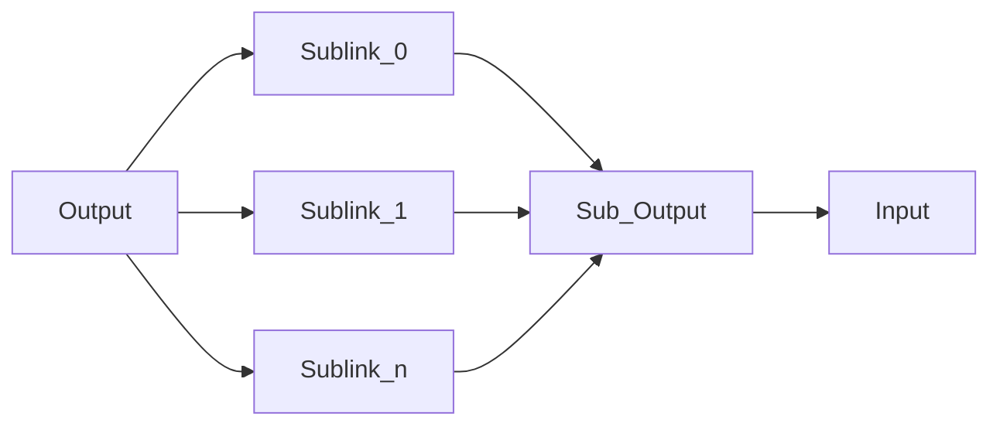
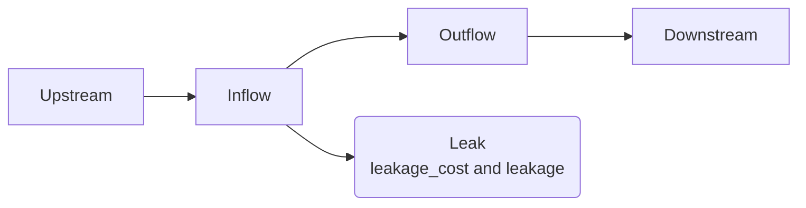

# Write a custom node

## Basic nodes
Pywr provides several nodes to build your model network. These can be grouped into two categories:

- flow nodes: the nodes are the typical nodes that represent rivers, pipes and other features
from, through or to which a resource can flow. These nodes are typically characterised by
minimum and maximum flow rates. 
- storage nodes: these provide the ability to store water resource from one time-step to 
another, and are characterised by minimum, maximum and initial volumes.

In regard to flow nodes, there are three fundamental types of nodes in Pywr:

- [pywr.nodes.Input][] node adds water to the system
- [pywr.nodes.Output][] node removes water from the system
- [pywr.nodes.Link][] node does not add or remove water from the system but is normally used to set additional
constraints.

There is a fourth node type (the `Storage` node), which can be considered fundamental because 
there are special rules for its behaviour in the linear programme used to solve the water balance.
Storage nodes can carry water from one timestep to the next.

All other node types in Pywr are subclasses of these base types. For example, the 
[pywr.domains.river.Catchment][] node type is a special case of a [pywr.nodes.Input][] where
the `min_flow` and `max_flow` properties are equal.

## Compound nodes
The most common way to create a new node type is using a compound node. A compound node contains one or more existing
nodes and is used to manage common or more complex arrangements of the basic node types.

An example of a compound node is the [pywr.nodes.PiecewiseLink][] which is composed of a link `Output`, which receives water from upstream and a link
`Input`, which conveys water downstream, connected by a set of links in parallel (`Sublink_0`, ... `Sublink_n`) each with
a different ``max_flow`` and ``cost``, illustrated below:



### Implement a custom compound node
The next block of code implement a node called `LeakyPipe` with the following structure:


 
The node is connected to the network upstream to the internal node called "Inflow". Water can
be routed to the downstream network via the "Outflow" node or, if `leakage_cost` allows,
part of the water is lost in the "Leak" output node. The loss volume equals to `leakage`.

The code is explained after the code block.

```python
from pywr.core import Timestep
from pywr.nodes import Node, Link, Output
from pywr.parameters import Parameter


class LeakyPipe(Node):
    """This class implements a leaky pipe using the following schematic:

    UPSTREAM -->-- INFLOW -->-- OUTFLOW -->-- DOWNSTREAM
                     |
                     \------>--  LEAK

    Attributes
    ----------
    leakage: Parameter
        The leakage.
    leakage_cost : float
        The leakage cost set on the LEAK node in the schematic.
    inflow : Link
        The INFLOW node in the schematic.
    outflow : Link
        The OUTFLOW node in the schematic.
    leak : Output
        The LEAK node in the schematic.
    """

    __parameter_value_attributes__ = ("leakage_cost",)
    __parameter_attributes__ = ("leakage",)

    def __init__(
        self, leakage: Parameter, leakage_cost: float = -99999, *args, **kwargs
    ):
        """
        Initialise the class.

        Parameters
        ----------
        leakage: Parameter
            The leakage.
        leakage_cost : Optional[float], default=-99999
            The leakage cost set on the LEAK node in the schematic.
        """
        self.allow_isolated = True  # Required for compound nodes

        super(LeakyPipe, self).__init__(*args, **kwargs)

        # Define the internal nodes. The parent of the nodes is defined to identify
        # them as sub-nodes.
        self.inflow = Link(self.model, name="{} In".format(self.name), parent=self)
        self.outflow = Link(self.model, name="{} Out".format(self.name), parent=self)
        self.leak = Output(self.model, name="{} Leak".format(self.name), parent=self)

        # Connect the internal nodes
        self.inflow.connect(self.outflow)
        self.inflow.connect(self.leak)

        # Define the properties of the leak (demand and benefit)
        self.leak.max_flow = leakage
        self.leak.cost = leakage_cost

    def iter_slots(
        self, slot_name: str | None = None, is_connector: bool | None = True
    ) -> None:
        """
        Connect the node to the correct slots.
        
        Parameters
        ----------
        slot_name: Optional[str], default=None
            The name of the slot to connect the node to.
        is_connector: bool, default=True
            Whether the node is a connector or not.
        """
        # This is required so that connecting to this node actually 
        # connects to the outflow sub-node, and connecting from this
        # node actually connects to the input sub-node
        if is_connector:
            yield self.outflow
        else:
            yield self.inflow

    def after(self, timestep: Timestep) -> None:
        """
        Make the flow on the compound node appear as the flow after
        the leak.
        
        Parameters
        ----------
        timestep: Timestep
            The current timestep.
        """
        self.commit_all(self.outflow.flow)
        # Make sure save is done after setting the flow
        super(LeakyPipe, self).after(timestep)
```

!!!info "Custom type registration"
    The custom node does not need to be "registered," unlike a [pywr.parameters.Parameter][] with the `register()` method,
    as this is done automatically using metaclasses. The new node type can be referenced from a JSON model provided
    that the class has been imported before the JSON is loaded.


#### Load node data via Python and JSON
When a parameter is loaded from a JSON document, this is done using the
[load()](./parameters.md#load-the-parameter-from-json-using-the-load-method) method. Nodes do not have
this method, as they cannot be directly loaded, but they implement a specific way of loading the node data using the class
attributes defined in L27 and L28:

- `__parameter_value_attributes__`: this is a class attribute which is a tuple of strings. The string is the
name of the parameter the nodes depends on. Add to this class parameters to the tuple that are constant values. In the example,
the cost `leakage_cost`, declared in the `__init__` signature, is a constant (`float`) and therefore the name goes in here. 
- `__parameter_attributes__`: this is a class attribute which is a tuple of strings similarly to `__parameter_value_attributes__`.
However the value of the parameter is a Pywr `Parameter` (not a constant).  In the `__init__` signature, the
loss `leakage` is in fact a parameter.

There is another additional attribute that is not used in the example, which is `__node_attributes__`. This is 
still a tuple of strings whose values are instances of Pywr `Nodes`. For example the [pywr.nodes.AggregatedStorage][]
relies on this attribute.


#### The `__init__()` method
The signature is:
```python
def __init__(
    self, leakage: Parameter, leakage_cost: float = -99999, *args, **kwargs
):
```

- `self`: this is the class instance.
- `leakage`: this is the parameter that calculates the leakage.
- `leakage_cost`: this is the constant cost assigned to the leakage.
- `*args`: this is any [positional arguments](https://docs.python.org/3/glossary.html#term-argument) passed to parent [pywr.parameters.Parameter][] class.
- `*kwargs`: this is any [keyword arguments](https://docs.python.org/3/glossary.html#term-argument) passed to [pywr.parameters.Parameter][] (such as the optimiser configuration).

L43 set the class attribute `allow_isolated` to `True`. This is required for compound nodes as the `LeakyPipe` node
is not connected to any node; the node being connected to the network are the `Output` and `Input` nodes. If you forget
to change this value, Pywr will raise an `Exception` as the network is not properly defined.

L49 to L59 create the internet nodes, edges and set the lekakage data. 

#### The `iter_slot()` method
The signature of this method is:

```python
def iter_slots(
    self, slot_name: str | None = None, is_connector: bool | None = True
) -> None:
```

This must yield the node instance where another node is connected from or to. In the model:

- when you create an edge from an upstream node to `LeakyPipe`, Pywr will execute the method with `is_connector` set to
`False`. 
- When you are creating an edge where `LeakyPipe` is the source node (i.e. is the connector or connecting to another node) `is_connector`
evaluates to `False`. 

In the L77 to L80, when `LeakyPipe` is a target node, we yield the internal `"Inflow"` node (therefore connecting the upstream
node). When `LeakyPipe` is a source node, we yield the `"Outflow"` node.

The `slot_name` argument is not used here. If you give the user the possiblity to choose the internal
node to connect to, you can rely on slots. This is not explained in this manual, but for
reference you can refer to the [`MultiSplitLink`](https://github.com/pywr/pywr/blob/9bae3d1ff9c628c96cbcb19c681868d745c226b1/pywr/nodes.py#L877) node code.

#### The `after()` method:
The signatue is:

```python
def after(self, timestep: Timestep) -> None:
```

This saves the flow of the `"Outflow"` to the `LeakyPipe` node. This node is isolated, and L92 tells
Pywr that the flow recorded by the compound node is the same as the `"Outflow"`. L94 finally calls the method of
the parent class to save the flow.

!!! warning "Recorders"
    The `after` method is not required, but is useful so that recorders can be attached to the compound node. Without
    this, the flow would be recorder as zero as the flow doesn't *actually* pass through the compound node but
    its internal nodes.

### Implement a non-compound node
The following shows how to implement a basic non-compound node. The node inherits from a [pywr.nodes.Storage][]
and internally creates a link node connected to the reservoir and a `target` node. The link 
release water based on the amount provided in `release`:

```python
from pywr.core import Timestep
from pywr.nodes import Storage, Node, Link
from pywr.parameters import Parameter

class ReservoirWithRelease(Storage):
    """This class implements a reservoir with a release:

    UPSTREAM -->-- RESERVOIR -->-- DOWNSTREAM
                     |
                     |
                     \------>--  RELEASE  --> TARGET
    """

    __parameter_attributes__ = ("release", *Storage.__parameter_attributes__)
    __node_attributes__ = ("target",)

    def __init__(self, release: Parameter, target: Node, *args, **kwargs):
        """
        Initialise the class.

        Parameters
        ----------
        release: Parameter
            The amount to release.
        target : Node
            The node where to route the release.
        """
        super(ReservoirWithRelease, self).__init__(*args, **kwargs)

        release_node = Link(
            self.model,
            name="{} In".format(self.name),
            max_flow=release,
            cost=-9999,
            parent=self,
        )
        release_node.connect(target)
```

The implementation is simpler as the node inherits all the properties and methods from the
storage node (including `iter_slots()`). The only exception is:

- `__parameter_attributes__` (L14): this attribute contains all the values in the parent node
and the new `release` attribute, otherwise the node will not work.
- `__node_attributes__` (L15): this is added to properly initialise the `target` node.
