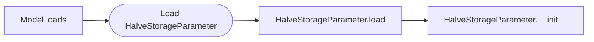

# Write a custom parameter
In Pywr you can implement your own parameter when you cannot implement the same logic using Pywr's built-in parameters.
This may be the cases for complex licenses or reservoir release rules.

!!!info "Use built-in parameters"
    Most model behaviours can be implemented by combining two or more pywr built-in parameters. You should always
    prefer this option.

## A simple parameter
This sections explains how to implement a parameter that takes today's storage of a `StorageNode` and
returns half of the current volume. Although this parameter can be easily implemented using 
an [pywr.parameters.AggregatedParameter][], it is simple enough to understand some key concepts about custom parameters.

Here is the code; each section is explained at the end of the code block:

```python
"""  
This file contains one parameter that get today's storage and  
returns half of the current volume.  
"""  
  
from pywr.core import ScenarioIndex, Timestep  
from pywr.model import Model  
from pywr.nodes import Storage  
from pywr.parameters import Parameter  
  
  
class HalveStorageParameter(Parameter):  
    """ Halve a storage's volume """  
  
    def __init__(  
         self,  
         model: Model,  
         storage_node: Storage,  
         *args,  
         **kwargs,  
    ) -> None:  
        """  
        Initialise the parameter.
        :param model: The model instance.
        :param storage_node: The node representing the reservoir.
        """
        super().__init__(model, *args, **kwargs)  
        self.storage_node = storage_node  
  
    def value(self, timestep: Timestep, scenario_index: ScenarioIndex) -> float:  
        """  
        Return half the storage.
        :param timestep: The model timestamp.
        :param scenario_index: The scenario index.
        :return: The new storage value  
        """
        sid = scenario_index.global_id  
        current_storage = self.storage_node.volume[sid]  
  
        return current_storage / 2  
  
    @classmethod  
    def load(cls, model: Model, data: dict) -> "HalveStorageParameter":  
        """  
        Load the parameter from the dictionary.
        :param model: The model instance.
        :param data: The parameter data dictionary.
        :return: The class  
        """
        storage_node = model.nodes[data.pop("storage_node")]  
        return HalveStorageParameter(model, storage_node, **data)  
  
    
HalveStorageParameter.register()
```

In pywr, a custom parameter is a class or object, in this example this is called `HalveStorageParameter`. To let
pywr know this is a pywr parameter, the class must inherit from the [pywr.parameters.Parameter][] class. This is an object that is 
defined inside the pywr code and contains additional methods pywr relies on. 

!!!info "Parameter class name"
    Make sure to always use a parameter name that explains what the component does and always use the 
    [CamelCase](https://en.wikipedia.org/wiki/Camel_case) notation to name classes. The class name should ends with
    the "Parameter" suffix to highlight this is a parameter, although this is not mandatory for the code to work. 

!!!info "Parent class"
    You can potentially inherit from any Pywr class to extend the behaviour of any existing parameter.

### Load the parameter from JSON using the `load()` method
When you use a JSON file to load your model, this is how the parameter is initialised:




First pywr loads your parameter by calling the `load` method at the end of the class. This method reads the 
parameter configuration defined in the JSON file and then initialises the class by calling the `__init__` method.

The signature of the `load` function cannot be changed, as it is defined by pywr, and must have the `@classmethod`
decorator. It is:

```python
@classmethod
def load(cls, model: Model, data: dict) -> "HalveStorageParameter":
```

- `cls`: this is the class being initialised.
- `model`: this is the [pywr.core.Model][] object containing the loaded pywr model.
- `data`: this is the dictionary in the JSON file you define to configure your parameter. 


If the parameter JSON configuration is:

```json
{
  "My custom parameter": {
    "type": "HalveStorage",
    "storage_node": "Elan valley"
  }
}
```

the `data` dictionary passed to the function is:

```json
{
  "storage_node": "Elan valley"
}
```

You can add anything you want to the dictionary as long as it contains the dictionary keys
used in the body of the load method. In the function body, in the line

```python
storage_node = model.nodes[data.pop("storage_node")]  
```

we only extract data from the `storage_node` key, whose value is `Elan valley` , the name of the node we are 
interested in halving the storage of. In the line we "pop" or extract the value from the dictionary 
and the get the node object representing the storage. In pywr, `model.nodes` is an iterator and 
you can use the `[]` (square bracket operator) to get the node object base on its name.

In the last line

```python
  return HalveStorageParameter(model, storage_node, **data) 
```

we initialise the class and return its instance. When we initialise the class, Python calls the `__init__` method; 
note that the signature of the class reflects the `__init__` method signature, where the first argument is the
model instance and the second the node instance.

#### Why **data?
The last argument passed to the method is `**data` which passes any option you did not use in the `data` 
dictionary to the class. For example, if you are using a genetic algorithm to optimise your model, you need to pass 
the optimiser configuration to the parameter class, even if these options are not used by the code you wrote. For example, 
if you have in your JSON file:

```json
{
  "My custom parameter": {
    "type": "HalveStorage",
    "storage_node": "Elan valley",
    "is_variable": true,
    "lower_bounds": 0.16,  
    "upper_bounds": 0.5
  }
}
```

the `**data` passed to the `__init__` method will contain:

```json
{
  "is_variable": true,
  "lower_bounds": 0.16,  
  "upper_bounds": 0.5
}
```

### The `__init__()` method
The signature is:
```python
def __init__(  
    self,  model: Model, storage_node: Storage, *args, **kwargs,  
) -> None:
```

- `self`: this is the class instance.
- `model`: this is the object containing the loaded pywr model.
- `storage_node`: this is the instance of the storage node.
- `*args`: this is any [positional arguments](https://docs.python.org/3/glossary.html#term-argument) passed to parent [pywr.parameters.Parameter][] class.
- `*kwargs`: this is any [keyword arguments](https://docs.python.org/3/glossary.html#term-argument) passed to [pywr.parameters.Parameter][] (such as the optimiser configuration).

The first line:
```python
  super().__init__(model, *args, **kwargs)
```
initialises the [pywr.parameters.Parameter][] parent class. **It is important you add this line**, otherwise your parameter will not work 
properly. 

The second line
```python
  self.storage_node = storage_node
```

simply stores the node instance into the class itself. We do this because we need to later access the storage 
node information when we halve the storage.


!!!note
    This method should always receive the objects of nodes, parameters and recorders. Do not pass a parameter 
    name and load the parameter inside the `__init_`_ method.

!!!warning
    You should initialise the class by passing `**data` in the `load` method and let the `__init__` method receive
    the `*args` and `**kwargs` arguments.

### The `value()` method
This method belongs to the [pywr.parameters.Parameter][] parent class and you cannot change its signature:
```python
def value(self, timestep: Timestep, scenario_index: ScenarioIndex) -> float:
```

This method is called by pywr at each timestep and for each scenario to evaluate the parameter value:

- [pywr.core.Timestep][] is the class containing the current timestep. You can access the current day or month for example (using `timestep.month`)
- [pywr.core.ScenarioIndex][] is the class representing a pywr scenario.

Line 
```python
sid = scenario_index.global_id
```

is used to access the scenario number. Line

```python
current_storage = self.storage_node.volume[sid]
```

get today's storage for the current scenario. `volume` is a property of the [pywr.nodes.Storage[] which contains an
array of current storages for all scenario.

The method finally returns half the storage. Pywr always exepts only one number (`float`) is returned by the `value()` 
method of a parameter.

!!!note "Scenario support"
    Even if your model does not rely on scenarios, it's always a good practise to handle scenarios or states
    in your parameter.

### Register
The last line of the class file calls:
```python
HalveStorageParameter.register()
```

`register()` is a method in the [pywr.parameters.Parameter][] class used to register your parameter in the internal register so 
that pywr can tracks the available parameter types. If you forget this line, Pywr will not be able to initialise
your parameter.

!!!success "Parameter import"
    Before loading your model, you must import the Python module containing the parameter code. The import will
    call the `register()` method and make the parameter available to the model.

## Tracking state with setup, reset, before and after
The [pywr.parameters.Parameter][] abstract class also implements the `setup()`, `reset()`, `before()` and `after()` methods which you 
can re-implement. Each method is called at different stages of a model run:

- `setup()` is called once at the start of a model run, before the first
timestep. This is only called only if the structure of the model when the model becomes
dirty. The model is said to be "dirty" if nodes or edges are added or removed, resulting in a change to the structure
of the linear programme used to solve the model. This usually requires Parameters, which track state, to
reallocate memory, instead of just resetting values.
- `reset()` is called at the start of every model run. 
- `before()` and `after()` methods are called before and after each timestep, respectively. These
methods can be used when a parameter needs to track state between timesteps, and you need to read the
model flows, after the solver has found a solution, or access other data. 

The example below implements a basic licence parameter to track the volume
remaining in the licence. 

```python
from pywr.core import Timestep, ScenarioIndex
from pywr.model import Model
from pywr.nodes import Node
from pywr.parameters import Parameter
import numpy as np

class LicenceParameter(Parameter):
    def __init__(self, model: Model, total_volume: float, node: Node, **kwargs):
        super().__init__(model, **kwargs)
        self.total_volume = total_volume
        self.node = node

    def setup(self):
        """Allocate an array to hold the parameter state."""
        super().setup()
        num_scenarios = len(self.model.scenarios.combinations)
        self._volume_remaining = np.empty([num_scenarios], np.float64)

    def reset(self):
        """Reset the amount remaining in all states to the initial value."""
        self._volume_remaining[...] = self.total_volume

    def value(self, _timestep: Timestep, scenario_index: ScenarioIndex):
        """
        Return the current volume remaining for the scenario.
        :param timestep: The model timestamp.
        :param scenario_index: The scenario index.
        :return: The new storage value  
        """
        return self._volume_remaining[scenario_index.global_id]

    def after(self):
        """Update the state."""
         # get current timestep
        timestep = self.model.timestepper.current 
        flow_during_timestep = self.node.flow * timestep.days
        self._volume_remaining -= flow_during_timestep
        # remaining volume cannot be less than zero
        self._volume_remaining[self._volume_remaining < 0] = 0  

    @classmethod
    def load(cls, model: Model, data: dict):
        """  
        Load the parameter from the dictionary.
        :param model: The model instance.
        :param data: The parameter data dictionary.
        :return: The class  
        """
        total_volume = data.pop("total_volume")
        node = model.nodes[data.pop("node")]
        return cls(model, total_volume, node, **data)

LicenceParameter.register()
```

The parameter:

1. Initialises the class attribute `_volume_remaining` in the `setup()` method to an array
of size equals to the number of model scenarios. Remember to call the method on the parent class
to using `super().setup()`.
2. Returns the remaining license in the value method. As you can see the remaining volume does
not depend on the timestep.
3. Updates the remaining volume for each scenario in the `after()` method. The method
takes the flow through the node, which returns an array whose size equals the number of model scenarios.
And each item in the `_volume_remaining` is then reduced by the node's flow, giving the remaining
volumes in each scenario.

!!!note "Scenario support"
    Even if your model does not rely on scenarios, it's always a good practise to handle states
    in your parameter using scenarios.

## Dependency on other parameters
If your parameter relies on another parameter, you need to make sure to implement your custom
component in a specific way.  

### Loading the dependant parameter (JSON only)
If you are loading the model from a JSON document, it is always a good implementation to load the dependant
parameter in the `load()` method. Suppose you have the following model where the `flow` attribute depends 
on an inline `Dataframe` parameter:

```json
{
  "My custom parameter": {
    "type": "HalveStorage",
    "storage_node": "Elan valley",
    "flow": {
      "type": "dataframe",  
      "table": "Inflows",  
      "column": "Usk Reservoir"  
   }
  }
}
```

In the `load()` method use:

```python
from pywr.parameters import load_parameter
from pywr.model import Model

class HalveStorageParameter:
    
    @classmethod  
    def load(cls, model: Model, data: dict) -> "HalveStorageParameter":  
        """  
        Load the parameter from the dictionary.
        :param model: The model instance.
        :param data: The parameter data dictionary.
        :return: The class  
        """
        storage_node = model.nodes[data.pop("storage_node")]  
        flow = load_parameter(model, data.pop("flow"))
        return HalveStorageParameter(model, storage_node, flow, **data)  
```

The parameter instance is first loaded using the `load_parameter` function and its name which is
stored in `data.pop("flow")`. If the parameter was already loaded
by pywr, `load_parameter` will simply return the parameter instance, as if you were
calling `model.parameters[data.pop("flow")]`. Finally, the parameter instance in the `flow`
variable is passed to the class constructor.

!!!warning "Parameter precedence"
    If you try accessing `model.parameters[data.pop("flow")]` and the parameter is not loaded
    yet, you will get an exception.

### Define parameter as child
In the `__init__` method, you need to register the dependant parameter by adding it
to the `children` list attribute as follows:

```python
def __init__(self, model: Model, flow: Parameter, *args, **kwargs) -> None:
    ...
    self.flow = flow
    self.chldren.add(flow)
    ...
```

This informs pywr that the value of the parameter instance in `flow` must be fetched first. 

!!!warning "Dependency on other parameters"
    The value of each parameter is calculated at the start of every timestep. A dependency tree is used to ensure that
    parameters are evaluated in the correct order and that there are no circular dependencies.
     When writing a parameter these dependencies need to be defined explicitly by modifying the
    `Parameter.parents` or `Parameter.children` attributes.

### Getting the value of the existing parameter
To get the value of the dependant parameter in the `value()` method, you can call 
`value()` on the parameter instance:

```python
 def value(self, timestep: Timestep, scenario_index: ScenarioIndex) -> float:  
    """  
    Get the parameter value.
    :param timestep: The model timestamp.
    :param scenario_index: The scenario index.
    :return: The new value.  
    """
    ...
  
    todays_flow = self.flow.value(timestep, scenario_index)  
  
    ... 
```

or the `get_value()` method, which contains the values of the parameter for the current timestep
for all scenarios:

```python
 def value(self, timestep: Timestep, scenario_index: ScenarioIndex) -> float:  
    """  
    Return half the storage.
    :param timestep: The model timestamp.
    :param scenario_index: The scenario index.
    :return: The new storage value . 
    """
    ...

    todays_flow = self.flow.get_value(scenario_index)  
  
    ... 
```

## Getting a calculated node's flow
If you need to get the calculated flow for a node, you can access the flow at the
previous time step using:

```python
def value(self, timestep: Timestep, scenario_index: ScenarioIndex) -> float:  
    """
    Return half the flow.
    :param timestep: The model timestamp.
    :param scenario_index: The scenario index.
    :return: The new flow value.  
    """
    sid = scenario_index.global_id
    self.my_node.prev_flow[sid]
```

`my_node` is the node instance and `prev_flow` is the attribute storing yesterday's solutions for all scenarios. The node flow
solution for the current timestep is updated after pywr has calculated all the parameters' values.

## Improving performance with Cython
Parameters are evaluated many times and can be a significant part of the model run time. Many of the parameters in the
pywr have been written in [Cython](https://cython.org) to improve performance. Custom parameters can be written in 
Cython too and can also be used to link to external C/C++ libraries. 

When working with Cython, to improve performance you should:

- define the types of all variables and class attributes you initialise throughout your code. Adding
types allows Cython to compile your code down to C, often resulting in dramatic performance gains.
- define, when possible, `cdef` methods that can be accessed only by the Cython code.

This section explains how to implement a custom parameter in Cython that calculates the square of another
value, and how to compile the final Python module.

### The Cython parameter

```cython
from pywr.parameters._parameters cimport Parameter
from pywr._core cimport Timestep, ScenarioIndex

cdef extern from "math.h":
    double pow(double x, double y)

cdef class SquaredParameter(Parameter):
    cdef double _value

    def __init__(self, model, value, **kwargs):
        """
        Initalise the class.
        :param model: The model instance.
        :param value: The value to square.
        """
        super().__init__(model, **kwargs)
        self._value = value

    cpdef double value(self, Timestep ts, ScenarioIndex scenario_index) except? -1:
        """
        Calculate the value.
        :param timestep: The model timestamp.
        :param scenario_index: The scenario index.
        :return: The new value.  
        """
        return pow(self._value, 2.0)

    @classmethod
    def load(cls, model, data):
        """Load the parameter via JSON."""
        value = data.pop("value")
        return cls(model, value, **data)

SquaredParameter.register()
```

- The parameter now inherits from the `Parameter` Cython type. This is imported using the 
`cimport` statement from the `pywr.parameters._parameters` module.
- The class has one attribute called `_value` which is defined just below the class name
statement using the `cdef` keyword. The attribute is of type `double`.
- The `__init__` method of the parameter is defined as Python method using the `def` syntax. This method
implementation follows the same principle as if you were writing a Python method.
- The signature of the `value()` method is different. This must be defined as `cpdef` method as it needs to
be accessible by both Cython and Python code. The input parameters have specific types which are imported
using the `cimport` statement from the Pywr package.
- The `load()` method signature does not change.
- Before the class, we import the `pow` function from the C `math` library.


### Compile the parameter
Your parameter needs to be "cythonised" first, which translates your code to a C file, and then
compiled. There are two ways of compiling the code which are explained in the next two sections.
Additional information on how to compile Cython files is available [here](https://docs.cython.org/en/stable/src/quickstart/build.html).

The examples assume you have saved the Cython code into a file called `custom_parameter.pyx`.

!!!info "Compiler needed"
    This guide assumes you have already installed the C compiler in your OS and installed
    the Cython package. To install the compiler, you can refer to the
    [Installing from source](../install/from_source.md) section.

#### Using pyximport
If your module does not require any special build setup, then you can use the `pyximport` module. You
can import the .pyx file as if it was a .py file:

```python
import pyximport
pyximport.install()

from pywr.model import Model
import custom_parameter

model = Model.load("simple.json")
model.run()
```

The `pyximport` module saves the compiled file in a temporary directory; you can access where the file is
stored using `custom_parameter.__file__`. If you plan to distribute the compiled module or need
to combine different files into one module, it is best to use the next approach.

#### Using setup.py
This is an example of a `setup.py` file:

```python
from distutils.extension import Extension
from Cython.Build import cythonize
from setuptools import setup

setup(
    ext_modules=cythonize(
        [
            Extension(
                name="libs.custom_parameter",
                sources=[
                    "libs/custom_parameter.pyx"
                ]
            )
        ]
    ),
    compiler_directives={"language_level": "3"}
)
```

Run the setup script with the following command:

    python setup.py build_ext --inplace

This will generate a `custom_parameter.c` file and a `custom_parameter.so` (or `custom_parameter.pyd` on Windows) file,
which is the shared library you can import in Python.

For additional documentation on Cython you can read the [official Cython documentation](https://cython.readthedocs.io/en/stable/index.html).

## Best practices 
### Type hints
It is a good practise to add [type hints](https://docs.python.org/3/library/typing.html) to your parameter
methods. These are not used by Python or pywr and do not affect the behaviour of the Python code. They are
used by [IDEs](https://en.wikipedia.org/wiki/Integrated_development_environment) to spot errors in the 
parameter implementation or when you are initialising the custom class from a Python script. Type hints also give you
some guidance about the accepted types by the `__init__` method. 

### Documentation (docstrings)
It is always a good practise to add documentation to your class and methods, in particular if another modeller 
has never worked with your parameter before. There are 4 types of documentation you should implement:

- at top of the file: this explains what the file contains (in terms of functions or classes)
- below the `class` statement: this explains what the class does.
- below each method: this explains what the method does, and about the input and output arguments.

### Code formatting
Your Python code should always be formatted so that is readable. Use 
[black](https://black.readthedocs.io/en/stable/index.html) or [ruff](https://docs.astral.sh/ruff/formatter/)
to automatically arrange your code.

### Code linting
Make sure to lint your code and documentation using tools such as [Flake8](http://flake8.pycqa.org) or
[Ruff](https://docs.astral.sh/ruff/linter/)  to identify potential errors, stylistic issues, and coding 
standard violations.

### Test
Every time you write code, it is a good idea to test that your code works under any scenario. This is done by
implementing [unit tests](https://en.wikipedia.org/wiki/Unit_testing) that check your parameter returns the 
expected values. Python offers different tools to implement tests such as the [Python unittest framework](https://docs.python.org/3/library/unittest.html)
or the [pytest package](https://docs.pytest.org/en/stable/).

