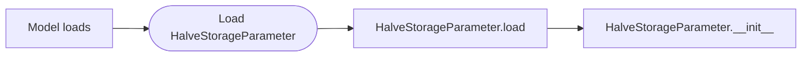

# Write a custom parameter
In Pywr you can implement your own parameter when you cannot implement the same logic using Pywr's built-in parameters.
This may be the cases for complex licenses or reservoir release rules.

## A sample parameter
This sections explains how to implement a parameter that takes today's storage of a `StorageNode` and, 
returns half of the current volume. Although this parameter can be easily implemented using 
an `AggregatedParameter`, it is simple enough to understand key concepts of custom parameters.

Here is the code; each section is explained at the end of the code block:

```python
"""  
This file contains one parameter that get today's storage and  
returns half of the current volume.  
"""  
  
from pywr.core import ScenarioIndex, Timestep  
from pywr.model import Model  
from pywr.nodes import Storage  
from pywr.parameters import Parameter  
  
  
class HalveStorageParameter(Parameter):  
    """ Halve a storage's volume """  
  
    def __init__(  
         self,  
         model: Model,  
         storage_node: Storage,  
         *args,  
         **kwargs,  
    ) -> None:  
        """  
        Initialise the parameter.
        :param model: The model instance.
        :param storage_node: The node representing the reservoir.
        """
        super().__init__(model, *args, **kwargs)  
        self.storage_node = storage_node  
  
    def value(self, timestep: Timestep, scenario_index: ScenarioIndex) -> float:  
        """  
        Return half the storage.
        :param timestep: The model timestamp.
        :param scenario_index: The scenario index.
        :return: The new storage value  
        """
        sid = scenario_index.global_id  
        current_storage = self.storage_node.volume[sid]  
  
        return current_storage / 2  
  
    @classmethod  
    def load(cls, model: Model, data: dict) -> "HalveStorageParameter":  
        """  
        Load the parameter from the dictionary.
        :param model: The model instance.
        :param data: The parameter data dictionary.
        :return: The class  
        """
        storage_node = model.nodes[data.pop("storage_node")]  
        return HalveStorageParameter(model, storage_node, **data)  
  
    
HalveStorageParameter.register()
```

In pywr a custom parameter is defined as a class or object; in this example this is called `HalveStorageParameter`. To let pywr know this is a pywr parameter, the class must inherit from the `Parameter` class. This is an object that is defined inside the pywr code and contains additional methods pywr relies on. 

!!!info "Parameter class name"
    Make sure to always use a parameter name that explains what the components does and always use the 
    CamelCase notation to name classes.

### Load the parameter from JSON using the `load()` method
When you use a JSON file to load your model this is how the parameter is initialised:




First pywr loads your parameter by calling the `load` method at the end of the class. This method reads the 
parameter configuration defined in the JSON file and then initialises the class by calling the `__init__` method.

The signature of the `load` function cannot be changed, as it is defined by pywr, and must have the `@classmethod`
decorator. It is:

```python
def load(cls, model: Model, data: dict) -> "HalveStorageParameter":
```

- `cls`: this is the class being initialised.
- `model`: this is the object containing the loaded pywr model.
- `data`: this is the dictionary in the JSON file you use to configure your parameter. 


If the parameter JSON configuration is:

```json
{
  "My custom parameter": {
    "type": "HalveStorage",
    "storage_node": "Elan valley"
  }
}
```
the `data` dictionary passed to the function is:
```json
{
  "storage_node": "Elan valley"
}
```

You can add anything you want to the dictionary as long as it contains the dictionary keys
used in the load method. In the function body, in the line

```python
  storage_node = model.nodes[data.pop("storage_node")]  
```

we only extract data from the `storage_node` key, whose value is `Elan valley` , the name of the node we are 
interested in halving the storage of. In the line we "pop" or extract the value from the dictionary 
and the get the node object representing the storage. In pywr, `model.nodes` is an iterator and 
you can use the `[]` (square bracket operator) to get the node object base on its name.

In the last line

```python
  return HalveStorageParameter(model, storage_node, **data) 
```

we initialise the class and return its instance. When we initialise the class, Python calls the `__init__` method; 
note that the signature of the class mimics the `__init__` method signature.

#### Why **data?
The last argument passed to the method is `**data` which passes any option you did not use in the `data` 
dictionary to the class. For example, if you are using a genetic algorithm to optimise your model, you need to pass 
the optimiser configuration to the parameter class, even if these options are not used by the code you wrote. For example, 
if you have in your JSON file:

```json
{
  "My custom parameter": {
    "type": "HalveStorage",
    "storage_node": "Elan valley",
    "is_variable": true,
    "lower_bounds": 0.16,  
    "upper_bounds": 0.5
  }
}
```

the `**data` passed to the `__init__` method will contain:

```json
{
  "is_variable": true,
  "lower_bounds": 0.16,  
  "upper_bounds": 0.5
}
```

### The `__init__()` method
The signature is:
```python
def __init__(  
    self,  model: Model, storage_node: Storage, *args, **kwargs,  
) -> None:
```

- `self`: this is the class instance.
- `model`: this is the object containing the loaded pywr model.
- `storage_node`: this is the instance of the storage node.
- `*args`: this is any [positional arguments](https://docs.python.org/3/glossary.html#term-argument) passed to parent `Parameter` class.
- `*kwargs`: this is any [keyword arguments](https://docs.python.org/3/glossary.html#term-argument) passed to `Parameter` (such as the optimiser configuration).

The first line:
```python
  super().__init__(model, *args, **kwargs)
```
initialises the `Parameter` parent class. **It is important you add this line**, otherwise your parameter will not work properly. As you can see the class gets initialised by calling it's own `__init__` method with the model instance and any additional argument your class does not rely. 

The second line
```python
  self.storage_node = storage_node
```

simply stores the node instance into the class it`self`. We do this because we need to later access the storage node information when we halve the storage.


!!!note
    This method should always receive the objects of nodes, parameters and recorders. Do not pass a node 
    name and load the node inside the `__init_`_ method.

!!!warning
    You should initialise the class by passing `**data` in the `load` method and let the `__init__` method receive
    the `*args` and `**kwargs` arguments.

### The `value()` method
This method belongs to the `Parameter` parent class and you cannot change its signature:
```python
def value(self, timestep: Timestep, scenario_index: ScenarioIndex) -> float:
```

This method is called by pywr at each timestep and for each scenario to evaluate the parameter value:

- `Timestep` is the class containing the current timestep. You can access the current day or month for example (using `timestep.month`)
- `ScenarioIndex` is the class representing a pywr scenario.

Line 
```python
sid = scenario_index.global_id
```

is used to access the scenario number. Line

```python
current_storage = self.storage_node.volume[sid]
```

get today's storage for the current scenario. `volume` is a property of the `StorageNode` which contains an
array of current storages for each scenario.

The method finally returns half the storage. Pywr always excepts only one number (`float`) is returned by the `value()` method of a parameter.

!!!note "Scenario support"
    Even if your model does not rely on scenarios, it's always a good practise to handle scenarios in your parameter.

### Register
The last line of the class calls:
```python
  HalveStorageParameter.register()
```

`register()` is a function in the `Parameter` class used to register your parameter in the internal register so 
that pywr can tracks the available parameter type. If you forget this line, Pywr will not be able to initialise
your parameter.

!!!success "Parameter import"
    Before loading your model, you must import the Python module containing the parameter code.

## Other tips
### Using existing parameters
#### Loading an existing parameter
If your parameter relies on another parameter, you need to load the dependant parameter first. For example, 
if you are using an inline parameter in the `flow` key:

```json
{
  "My custom parameter": {
    "type": "HalveStorage",
    "storage_node": "Elan valley",
    "flow": {
      "type": "dataframe",  
      "table": "Inflows",  
      "column": "Usk Reservoir"  
   }
  }
}
```

or a normal parameter

```json
{
  "My custom parameter": {
    "type": "HalveStorage",
    "storage_node": "Elan valley",
    "flow": "Flow parameter"
  }
}
```

it is always a good implementation to load the parameter in the `load()` method:

```python
@classmethod  
def load(cls, model: Model, data: dict) -> "HalveStorageParameter":  
    """  
    Load the parameter from the dictionary.
    :param model: The model instance.
    :param data: The parameter data dictionary.
    :return: The class  
    """
    storage_node = model.nodes[data.pop("storage_node")]  
    flow = load_parameter(model, data["flow"])
    return HalveStorageParameter(model, storage_node, flow, **data)  
```

Pywr may have not loaded the dependant parameter yet, if your custom parameter gets loaded before. If the 
parameter is already loaded, `load_parameter` will return the parameter instance, as if you were
calling `model.parameters["Flow parameter"]`.

In the `__init__` method you also need to register the dependant parameter by adding it
to the `children` list attribute.

```python
def __init__(self, model: Model, other_parameter: Parameter, *args, **kwargs) -> None:
    ...
    self.other_parameter = other_parameter
    self.chldren.add(other_parameter)
    ...
```

#### Getting the value of the existing parameter
To get the value of the dependant parameter in the `value()` method, just call `value()` on the parameter instance:

```python
 def value(self, timestep: Timestep, scenario_index: ScenarioIndex) -> float:  
    """  
    Get the parameter value.
    :param timestep: The model timestamp.
    :param scenario_index: The scenario index.
    :return: The new value.  
    """
    ...
  
    other_parameter = self.other_parameter.value(timestep, scenario_index)  
  
    ... 
```

or `get_value()` which contains the values of the parameter for the current timestep for all scenarios:

```python
 def value(self, timestep: Timestep, scenario_index: ScenarioIndex) -> float:  
    """  
    Return half the storage.
    :param timestep: The model timestamp.
    :param scenario_index: The scenario index.
    :return: The new storage value  
    """
    ...

    other_parameter = self.other_parameter.get_value(scenario_index)  
  
    ... 
```

### Getting a calculated node's flow
If you need to get the calculated flow for a node, you can access the flow at the previous time step you can use:

```python
def value(self, timestep: Timestep, scenario_index: ScenarioIndex) -> float:  
    sid = scenario_index.global_id
    self.my_node.prev_flow[sid]
```

`my_node` is the node instance and `prev_flow` is the attribute storing yesterday's solution.

## Type hints
It is a good practise to add [type hints](https://docs.python.org/3/library/typing.html) to your parameter
methods. These do not affect the behaviour on the Python code and are not used by Python or pywr. They are
used to spot errors when you are initialising the parameter from a Python script and give you guidance about
the accepted types by the `__init__` method. 

## Documentation (docstrings)
It is always a good practise to also add documentation to your class, in particular if another modeller 
has not work with your parameter. There are 4 types of documentation you need to implement:

- top of the file: this explains what the file contains (in terms of functions or classes)
- below the `class` statement: this explains what the class does.
- below each method: this explains what the method does, and about the input and output arguments.

## Code formatting
Your Python code should always be formatted so that is readable. Use `black` or another tool to automatically arrange your code.

## Test
Every time you write code it is a good practise to test that your code works under any scenario. This is done by
implementing unit tests that check your parameter returns the expected values. 
