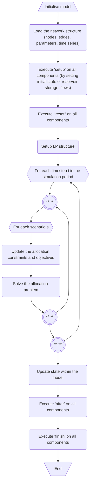

# The linear programming problem

## Formulation
Pywr is a water resource model software that relies on [Linear Programming (LP)](https://en.wikipedia.org/wiki/Linear_programming)
to optimise the allocation of water through a network of nodes (with reservoirs, rivers, demand centres).
Pywr solves a **constrained optimisation problem** at each simulation timestep defined as:

minimise

   CT <i>x</i> 

subject to

  <i>A</i> <i>x</i> ≤ <i>b</i>,  

  <i>l</i> ≤ <i>x</i> ≤ <i>u</i>

where:

- _x_ is the flow through the nodes
- _l_ and _u_ are the flow lower and upper bounds (i.e. the min and max flow)
- _A_ is a matrix that describes the structure of the network. Changes to this matrix are not permitted between time-steps. 
- C a matrix containing the user-defined cost coefficients for all nodes 
(e.g. pumping station, penalty for supply certain routers)

!!!info "Costs"
    The cost node property does not have to be monetised, it is a general penalty term used to specify the  
    penalties or benefits (negative penalties) that are incurred with net flow though the node.
    It is the modeller's task to properly set this costs to achieve the desired model behaviour.

## The algorithm
Pywr follows the following workflow when solving for _x_:

The time block loops through the time-steps; for each step Pywr solves the LP problem by looping
through the model scenarios. A scenario represents the same network but with different
set of constraints, for example a different demand level. Scenarios are explained
later in this manual and are entirely optional and this step does not use multi-processing or
any kind of parallel computing. When omitted, Pywr will solve only one (default)
scenario. 

Pywr implements the [GNU Linear Programming Kit (GLPK)](https://www.gnu.org/software/glpk/) and 
the [Mixed Integer Linear Programming (MILP)](https://lpsolve.sourceforge.net/5.5/) solver
to find the flow values. In step #6.a.ii, modellers can choose one of the two algorithms.