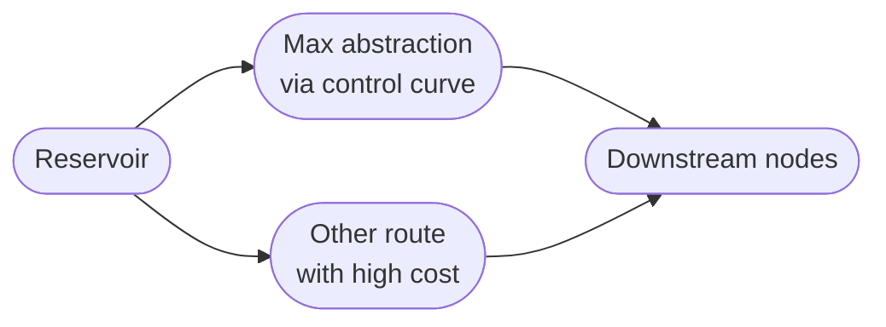

# Soft constraints
Soft constraints allow the model to breach a minimum or maximum flow constraints under certain conditions, for
example to overdraw from a reservoir meet demand.

!!!success "Local constraints"
    These constraints are similar to the Aquator "BestEffort" constraints, but are much more powerful 
    because they are local constraints: if one is breached the others will be not and can be controlled
    with synthetic costs.

## Minimum flow constraints
If you want to maintain a minimum flow through a node, you can use the `min_flow` attribute which is available for
all nodes. However, if the solver cannot ensure the minimum flow requirement under certain conditions, the solver will 
throw an exception and the model will stop running. 

For example, this may happen if you need to ensure a Works minimum flow,
but the source runs out of water or license:


To prevent this, you can use a soft minimum flow constraint, which is breached only when the flow cannot be met, 
when the constraint is properly setup with costs. The solution to the exmaple above, is to use
the following network structure:


On the "WTW's min_flow" node you need to set:

- a negative cost (for example `-100`)
- the `max_flow` attribute equal to the minimum flow requirement

the model will ensure the minimum flow (because it is convenient using this route), and the remainder of the 
water will be routed via the "Other route" node to meet demand. The WTW max flow is constrained by the downstream node
"WTW's `max_flow`", if you set the  `max_flow` attribute equal to the works' max capacity.

For this application, you can use the [PiecewiseLink node](../nodes/link.md#piecewise-link) which implements for you
the network structure shown above:

```json
{  
  "name": "WTW",  
  "type": "PiecewiseLink",  
  "max_flows": [55, null],  
  "cost": [-500, 0]
}
```

In the example above, the minimum of `55` is routed through the first link with a cost of `-500`; the second route has no
flow constraint (`null` is translated to `None` or no `max_flow`) and a zero cost.

## Maximum flow constraints
If you need to ensure a maximum flow through a node, but you want the model to be able to breach the constraint under
certain conditions, you can use a `Link` node with a very high cost. This may be the case, if a reservoir abstraction
is controlled by a rule curve, but when it is dry you want the model to breach the abstraction rule to meet demand. 

The solution is to use the following network structure:



- on the "Max abstraction" node set the maximum flow you want to abstract.
- set a high positive cost on the "Other route" node. When the cost is properly chosen, the model will overdraw 
from the source to meet demand. The cost you set must be chosen so that the model use this node only when it is needed
  (i.e. it is still convenient using this route when no other routes are available to meet demsnd).

For this constraint, you can use the [PiecewiseLink node](../nodes/link.md#piecewise-link) which implements for you
the network structure shown above:

```json
{  
  "name": "Abstraction",  
  "type": "PiecewiseLink",  
  "max_flows": [100, 20],  
  "cost": [-500, 200]
}
```

In the example above, the abstraction of `100` is routed through the first link with a cost of `-500`; the second route 
can deliver up to `20` but at a high cost.
