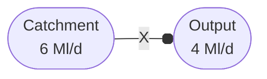

# Network inputs

## Input
| What it does         | <span style="font-weight:normal;">This node adds water into the network using the `max_flow`, `min_flow` and `cost` options.</span> |
|----------------------|-------------------------------------------------------------------------------------------------------------------------------------|
| **When is it used?** | Use this node to represent a groundwater source or a zonal import.                                                                  |
| **Pywr class**       | [pywr.nodes.Input][]                                                                                                            |
                                                                                                                                  

### Available key options

| Name     | Description                                                 | Required | Default value |
|----------|-------------------------------------------------------------|----------|---------------|
| min_flow | Set the minimum amount of water that the nodes must deliver | No       | 0             |
| max_flow | Set the maximum amount of water that the nodes must deliver | No       | Inf           |
| cost     | The penality cost per unit flow via the node                | No       | 0             |


### Example
This is an example of a node used to import water from another system:
```json
{  
  "name": "Zonal import",  
  "type": "input",  
  "max_flow": 12,  
  "cost": 15
}
```

## Catchment node
| What it does         | <span style="font-weight:normal;">This node adds water into the network using the `flow` and `cost` options.</span> |
|----------------------|---------------------------------------------------------------------------------------------------------------------|
| **When is it used?** | Use this node to represent a catchment.                                                                             |
| **Pywr class**       | `Catchment`                                                                                                         |
                                                                                                                                  
### Available key options

| Name | Description                                          | Required | Default value |
|------|------------------------------------------------------|----------|---------------|
| flow | Set the amount of water that the nodes must deliver. | No       | 0             |
| cost | The penality cost per unit flow via the node         | No       | 0             |

> NOTE: this is a simple node where `max_flow` and `min_flow` are set equal to `flow`

### Example
This is an example of a node used to deliver water into a reservoirs:
```json
{  
  "name": "Usk catchment",  
  "type": "catchment",  
  "flow": {  
    "type": "dataframe",  
    "table": "Inflow table",  
    "column": "Usk Reservoir"  
  }
}
```

### What is the difference between an input and catchment node?
An input node stops delivering water based on the downstream network restrictions. For example if 
you set the `max_flow` of an input node to `6` Ml/d and the downstream  demand to `4` Ml/d, the model will 
deliver only `4` Ml/d.


If you use the same setup, but you use a catchment node , the model will stop and the solver will fail. 
A catchment node always needs to deliver the amount of water you set.



Another example is when you have a river intake:


The above model will not work because the abstraction node limits the flow to
4 Ml/d and the "Catchment" node has not way of discharging the water that is not
abstracted (pywr will give you a "infeasible solution" message). The correct implementation is:


