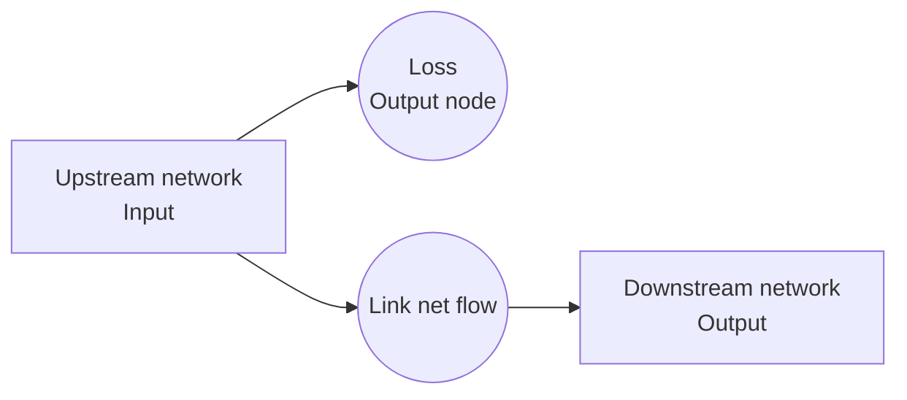
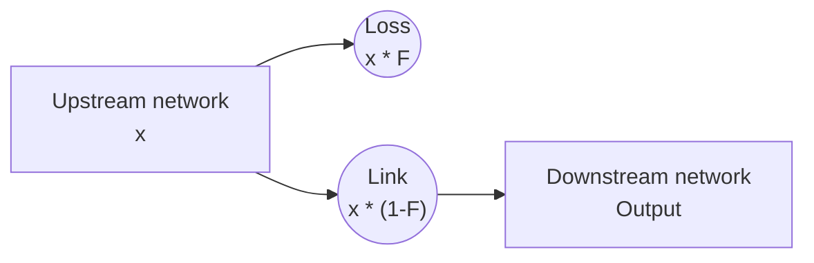
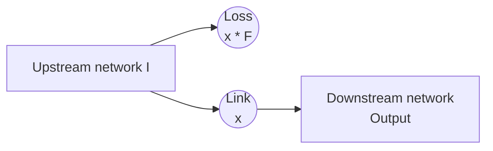

# Water transport

## Link node

| What it does         | <span style="font-weight:normal;">This node constrains water using the `max_flow`, `min_flow` and `cost` options.</span> |
|----------------------|--------------------------------------------------------------------------------------------------------------------------|
| **When is it used?** | Use this node to add constraints about WTW, pumping stations, pipes, valve or control curves.                            |
| **Pywr class**       | [pywr.nodes.Link][]                                                                                                      |

### Available key options

| Name     | Description                                      | Required | Default value |
|----------|--------------------------------------------------|----------|---------------|
| min_flow | Set the minimum amount of water through node     | No       | 0             |
| max_flow | Set the maximum amount of water through the node | No       | Inf           |
| cost     | The penality cost per unit flow via the node     | No       | 0             |

!!!warning "Min flow"
    Use `min_flow` constraints carefully. If the model cannot meet the minimum flow, the solver will fail and
    raise an Exception

### Example
This is a very simple example how to setup this node:
```json
{
  "name": "Service reservoir outlet",
  "type": "link",
  "max_flow": 21
}
```

## Loss link node

| What it does         | <span style="font-weight:normal;">This node constrains water using the `max_flow`, `min_flow` and `cost` options and add a local loss.</span> |
|----------------------|-----------------------------------------------------------------------------------------------------------------------------------------------|
| **When is it used?** | Use this node to model a WTW with losses or any leakage.                                                                                      |
| **Pywr class**       | [pywr.nodes.LossLink][]                                                                                                                       |


### Available key options

| Name             | Description                                                                                                                                                      | Required | Default value |
|------------------|------------------------------------------------------------------------------------------------------------------------------------------------------------------|----------|---------------|
| min_flow         | Set the minimum amount of water through node                                                                                                                     | No       | 0             |
| max_flow         | Set the maximum amount of water through the node                                                                                                                 | No       | Inf           |
| cost             | The penality cost per unit flow via the node                                                                                                                     | No       | 0             |
| loss_factor      | The proportion of flow that is lost through this node. If 0, losses will be 0.                                                                                   | No       | 0             |
| loss_factor_type | This determines the type of loss. This can be `net` to calculate the loss as proportion of net flow or `gross` to calculate the loss as proportion of gross flow | No       | net           |

### Internal representation

This node could be represented as follows:



- The node is connected to the two square blocks. Water enters the "Upstream network" and exits from the "Downstream network" block.
- The water is lost in the "Loss" link.
- The `min_flow` and `max_flow` are enforced on the net output after losses (node "Link" in diagram).

A detail explanation about the loss factor type is provided below.

#### Gross loss
Gross losses (when `loss_factor_type=gross`) are calculated as a proportion of the total flow into a node; this is
the "Upstream network" node in the first diagram. If `x` is the flow to find based on the set constraints 
(`min_flow`, `max_flow` and `cost`), the gross loss schematic is:



For example:

```python
from pywr.model import Model
from pywr.nodes import Output, Input, LossLink
from pywr.timestepper import Timestepper

model = Model()
input_node = Input(model, name="Input", max_flow=2)
link = LossLink(model, name="Link", loss_factor_type="gross", loss_factor=0.1)
demand = Output(model, name="Demand", cost=-100, max_flow=20)

input_node.connect(link)
link.connect(demand)

model.timestepper = Timestepper("2000-1-1", "2000-1-2")
model.run()

print(f"Input flow: {input_node.flow}")  # 2.0
print(f"To output: {link.flow}")  # 1.8
print(f"Internal loss: {link.output.flow}")  # 0.2
```
#### Net loss
Net losses (when `loss_factor_type=net`) are calculated as a proportion of the flow through the net flow node 
after the losses; this is the "Link" node in the first diagram. If `x` is the flow to find, the net loss schematic is:



with `I` equal to `x*(1+F)`.  `x` is found based on the set constraints (`min_flow`, `max_flow` and `cost`).

For example:
```python

from pywr.model import Model
from pywr.nodes import Output, Input, LossLink
from pywr.timestepper import Timestepper

model = Model()
input_node = Input(model, name="Input", max_flow=2)
link = LossLink(model, name="Link", loss_factor_type="net", loss_factor=0.1)
demand = Output(model, name="Demand", cost=-100, max_flow=20)

input_node.connect(link)
link.connect(demand)

model.timestepper = Timestepper("2000-1-1", "2000-1-2")
model.run()

print(f"Input flow: {input_node.flow}")  # 2.0
print(f"To output: {link.flow}")  # 1.8181
print(f"Internal loss: {link.output.flow}")  # 0.181818
```

### Example
This is an example of loss link for a Works:

```json
{  
  "name": "WTW",  
  "type": "losslink",  
  "max_flow": 43.25,  
  "cost": -100,  
  "loss_factor": 0.04058
}
```

## River node
This is just a Link node but used to represent a river.


## Piecewise link


## Multi split link

## Delay node

## River split

## River gauge

## River split with gauge