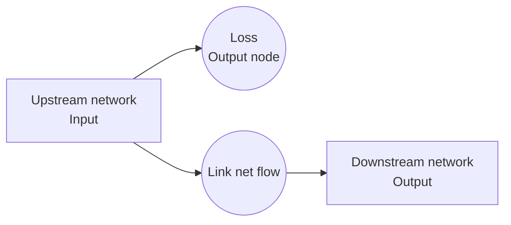
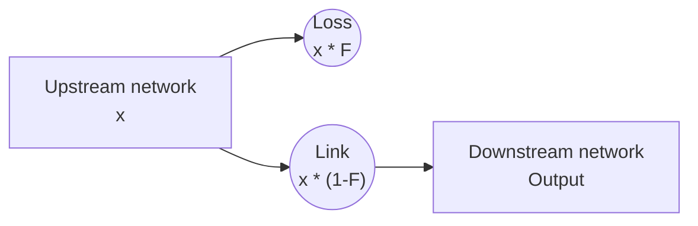
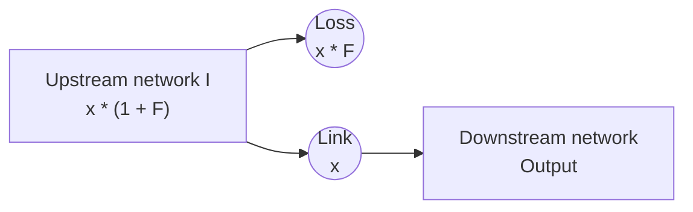
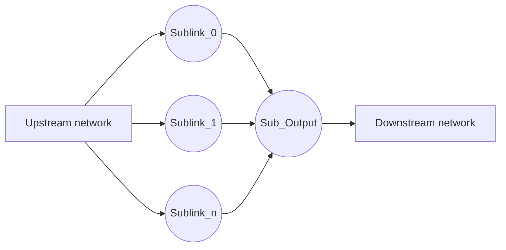
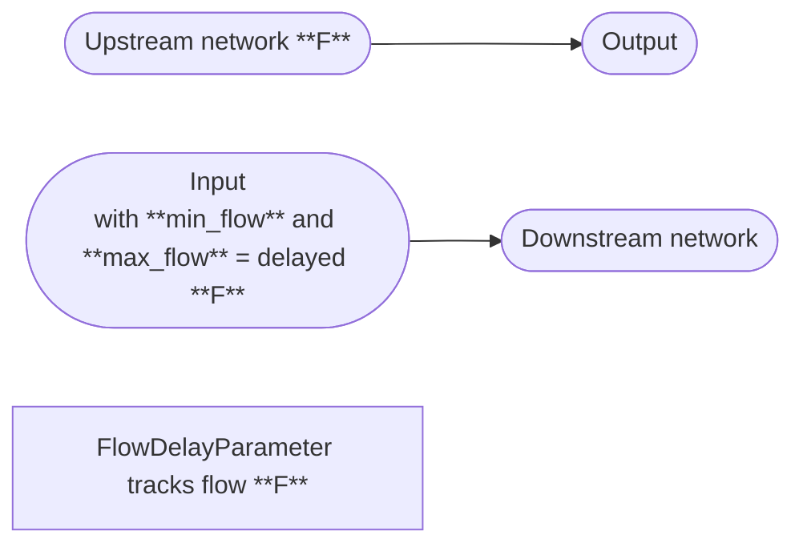
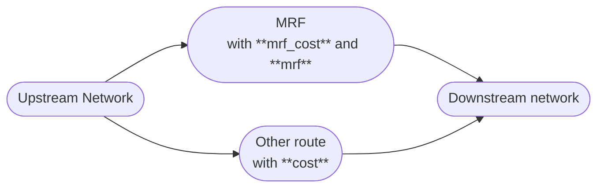

# Water transport
This page contains the key nodes used to move water into the network. Please refer to the [API page](../../api/nodes/links/link.md) to check all the
available link nodes.

## Link node

| What it does         | <span style="font-weight:normal;">This node constrains water using the `max_flow`, `min_flow` and `cost` options.</span> |
|----------------------|--------------------------------------------------------------------------------------------------------------------------|
| **When is it used?** | Use this node to add constraints on assets (such as WTW, pumping stations, pipes, or valve).                             |
| **Pywr class**       | [pywr.nodes.Link][]                                                                                                      |

### Available key options

| Name     | Description                                      | Required | Default value |
|----------|--------------------------------------------------|----------|---------------|
| min_flow | Set the minimum amount of water through node     | No       | 0             |
| max_flow | Set the maximum amount of water through the node | No       | Inf           |
| cost     | The penality cost per unit flow via the node     | No       | 0             |

!!!warning "Min flow"
    Use `min_flow` constraints carefully. If the model cannot meet the minimum flow, the solver will fail and
    raise an Exception

### Example
This is a very simple example how to setup this node:
```json
{
  "name": "Service reservoir outlet",
  "type": "link",
  "max_flow": 21
}
```

## Loss link node

| What it does         | <span style="font-weight:normal;">This node constrains water using the `max_flow`, `min_flow` and `cost` options and add a local loss.</span> |
|----------------------|-----------------------------------------------------------------------------------------------------------------------------------------------|
| **When is it used?** | Use this node to model a node with losses (such as works) or any leakage.                                                                     |
| **Pywr class**       | [pywr.nodes.LossLink][]                                                                                                                       |


### Available key options

| Name             | Description                                                                                                                                                                                             | Required | Default value |
|------------------|---------------------------------------------------------------------------------------------------------------------------------------------------------------------------------------------------------|----------|---------------|
| min_flow         | Set the minimum amount of water through node                                                                                                                                                            | No       | 0             |
| max_flow         | Set the maximum amount of water through the node                                                                                                                                                        | No       | Inf           |
| cost             | The penality cost per unit flow via the node                                                                                                                                                            | No       | 0             |
| loss_factor      | The proportion of flow that is lost through this node. If 0, losses will be 0.                                                                                                                          | No       | 0             |
| loss_factor_type | This determines the type of loss. This can be `net` to calculate the loss as proportion of net flow or `gross` to calculate the loss as proportion of gross flow. See below for a detailed explanation. | No       | net           |

### Internal representation

This node could be represented as follows:



- The node is connected to the two square blocks. Water enters the "Upstream network" and exits the network from the "Downstream network" block.
- The water is lost in the "Loss" link.
- The `min_flow` and `max_flow` are enforced on the net output after losses (node "Link net flow" in the diagram).

A detail explanation about the loss factor type is provided below.

#### Gross loss
Gross losses (when `loss_factor_type=gross`) are calculated as a proportion of the total flow into a node, which is
the "Upstream network" node in the diagram above. If `x` is the flow to find based on the set constraints 
(`min_flow`, `max_flow` and `cost`) and `F` the loss factor, the gross loss schematic is:



For example:

```python
from pywr.model import Model
from pywr.nodes import Output, Input, LossLink
from pywr.timestepper import Timestepper

model = Model()
input_node = Input(model, name="Input", max_flow=2)
link = LossLink(model, name="Link", loss_factor_type="gross", loss_factor=0.1)
demand = Output(model, name="Demand", cost=-100, max_flow=20)

input_node.connect(link)
link.connect(demand)

model.timestepper = Timestepper("2000-1-1", "2000-1-2")
model.run()

print(f"Input flow: {input_node.flow}")  # 2.0
print(f"To output: {link.flow}")  # 1.8
print(f"Internal loss: {link.output.flow}")  # 0.2
```

The model will supply `2` Ml/d and apply to this a 10% loss. The water lost inside the node is then `0.2` Ml/d. The
flow delivered downstream is the difference of the two component (`1.8` Ml/d).

#### Net loss
Net losses (when `loss_factor_type=net`) are calculated as a proportion of the flow through the net flow node 
after the losses; this is the "Link" node in the first diagram. If `x` is the flow to find and `F` the loss factor, the
net loss schematic is:



For example:

```python
from pywr.model import Model
from pywr.nodes import Output, Input, LossLink
from pywr.timestepper import Timestepper

model = Model()
input_node = Input(model, name="Input", max_flow=2)
link = LossLink(model, name="Link", loss_factor_type="net", loss_factor=0.1)
demand = Output(model, name="Demand", cost=-100, max_flow=20)

input_node.connect(link)
link.connect(demand)

model.timestepper = Timestepper("2000-1-1", "2000-1-2")
model.run()

print(f"Input flow: {input_node.flow}")  # 2.0
print(f"To output: {link.flow}")  # 1.8181
print(f"Internal loss: {link.output.flow}")  # 0.181818
```

The model will supply `2` Ml/d to the network and will deliver `2 / (1 + F) = 1.818` Ml/d downstream. The difference (`0.1818` Ml/d)
is lost through the internal output node.

### Example
This is an example of loss link for a Works:

```json
{  
  "name": "WTW",  
  "type": "losslink",  
  "max_flow": 43.25,  
  "cost": -100,  
  "loss_factor": 0.04058
}
```

## Piecewise link

| What it does         | <span style="font-weight:normal;">This node implements a non-linear piecewise cost function. It creates multiple parallel routers/nodes with its own maximum flow and associated cost. </span>                                                                            |
|----------------------|---------------------------------------------------------------------------------------------------------------------------------------------------------------------------------------------------------------------------------------------------------------------------|
| **When is it used?** | Use this node to model situations where the economic or operational characteristics of a water transfer change at different flow rates. For example when beyond a certain flow, the cost of pumping water may increase significantly due to increased energy consumption. |
| **Pywr class**       | [pywr.nodes.PiecewiseLink][]                                                                                                                                                                                                                                              |


### Available key options

| Name      | Description                                                                                                       | Required | Default value |
|-----------|-------------------------------------------------------------------------------------------------------------------|----------|---------------|
| nsteps    | The number of internal piecewise links to add..                                                                   | Yes      |               |
| max_flows | A monotonic increasing list of maximum flows for the piece wise function. The list size must be equal to `nsteps` | No       | []            |
| costs     | A list of costs corresponding to the `max_flow` steps. Its length must be the same as the length of `max_flows`.  | No       | []            |


### Internal representation
This nde is implemented using a compound node. This means that internally, it consists of several simpler Pywr 
nodes (specifically, multiple [pywr.nodes.Link][] nodes) connected in parallel. Each of these internal Link nodes
corresponds to one "segment" of the piecewise function, with its own `max_flow` and `cost` as defined by the input
parameters.

The structure is:



This node operates as follows.

- It creates as many internal nodes as the number given in `nsteps`.
- Each internal node is a [pywr.nodes.Link][] node whose name is "`node_name` Sublink `step_number`" where, `node_name` is the
name of the compound node (in the `name` attribute) and `step_number` is the number of piecewise link, starting from 0. You
can access the node instance by using that name.
- Each node is assigned a `max_flow` and/or `cost` taken from the lists `max_flows` and `costs`. On the first node "Sublink_0", the
`max_flow` and `cost` in position 0 is assigned, and so on until all nodes are exhausted.
- The links are connected to an [pywr.nodes.Output][] node called "`node_name` Sub Output". 

The cost, minimum and maximum flows are the sum of the costs and flows of all the link nodes.

!!!note "River gauge"
    The [river gauge](#river-gauge) node explained below is implemented using this node.

### Example
```json
{
  "nodes": [
    {
      "name": "Reservoir",
        "type": "Storage",
        "max_volume": 1000
    },
    {
        "name": "Demand",
        "type": "Output",
        "max_flow": 180
    },
    {
        "name": "Pumping station",
        "type": "PiecewiseLink",
        "max_flows": [50.0, 100.0, 50.0],
        "costs": [1.0, 2.5, 10.0]     
    }
  ],
  "edges": [
    ["Reservoir", "Pumping station"],
    ["Pumping station", "Demand"]
  ]
}
```

In this example:

- The "Pumping station" node can convey a flow up to `200`.
- The first `50` have a cost of `1.0` per unit.
- The next `100` (i.e., from `50` to `150` total flow) have a cost of `2.5` per unit.
- Any flow above `150`, up to the total capacity of `200`, have a higher cost of `10.0` per unit.


## Delay node

| What it does         | <span style="font-weight:normal;">This node delays the flow for a given number of time-steps or days.</span>                                             |
|----------------------|----------------------------------------------------------------------------------------------------------------------------------------------------------|
| **When is it used?** | Use this node to represent the time it takes for water to travel from one point to another (such as through a long canal, a river reach, or a pipeline). |
| **Pywr class**       | [pywr.nodes.DelayNode][]                                                                                                                                 |


### Available key options

| Name         | Description                                                                                                                                                                                                                                                                                                                                                                                | Required | Default value |
|--------------|--------------------------------------------------------------------------------------------------------------------------------------------------------------------------------------------------------------------------------------------------------------------------------------------------------------------------------------------------------------------------------------------|----------|---------------|
| timesteps    | Number of time steps to delay the flow                                                                                                                                                                                                                                                                                                                                                     | No       | 0             |
| days         | Number of days to delay the flow. Specifying a number of days (instead of a number of time steps); it is only valid if the number of days is exactly divisible by the model timestep delta (e.g., if the model timestep is 1 day, days: 5 is valid. If the model timestep is 7 days (weekly), days: 7 or days: 14 would be valid, but days: 5 would not).                                  | No       | 0             |
| initial_flow | Flow provided by node for initial time steps prior to any delayed when the flow is available. This is constant across all delayed time steps and any model scenarios. For example, if you have a delay of 3 timesteps, for timesteps 0, 1, and 2, the DelayNode will output this initial_flow value. From timestep 3 onwards, it will output the flow that entered the node at timestep 0. | No       | 0             |
| min_flow     | Set the minimum amount of water through node                                                                                                                                                                                                                                                                                                                                               | No       | 0             |
| max_flow     | Set the maximum amount of water through the node                                                                                                                                                                                                                                                                                                                                           | No       | Inf           |
| cost         | The penality cost per unit flow via the node                                                                                                                                                                                                                                                                                                                                               | No       | 0             |

### Internal representation
The [pywr.nodes.DelayNode][] holds incoming flow for a specified duration (either a fixed number of timesteps or a 
number of days) before releasing it. It is a composite node, meaning it internally consists of an [pywr.nodes.Input][]
and an [pywr.nodes.Output][]. A [pywr.parameters.FlowDelayParameter][] is used internally to manage the delay mechanism.

This node creates a gap in the network. Connections to the node are connected to the internal output node and 
connections from the node are connected to the internal input node.  



The node operates as follows:

1. A [pywr.parameters.FlowDelayParameter] tracks the flow **F** coming from the "Upstream network". 
2. This flow is routed to the internal "Output" node, to prevent water from entering the downstream route.
3. When the specified delay has passed (using `days` or `timesteps`), the flow **F** is released downstream and is enforced as
`min_flow` and `max_flow` on the "Input" node, which delivers the flow to the "Downstream network".

### Example
In this example, the flow is delayed by 3 days:

```json
{
  "nodes": [
    {
        "name": "Intake",
        "type": "Input",
        "max_flow": 100
    },
    {
        "name": "Canal delay",
        "type": "DelayNode",
        "days": 3,
        "initial_flow": 0.5
    },
    {
        "name": "Reservoir inflow",
        "type": "Link"
    }
  ],
  "edges": [
    ["Intake", "Canal delay"],
    ["Canal delay", "Reservoir inflow"]
  ]
}
```

Explanation:

- Water released from the "Intake" node enters "Canal delay".
- For the first 3 days of the simulation, "Canal delay" will output `0.5` (due to `initial_flow`).
- On day 4, "Canal delay" will output the water that entered it from "Intake" on day 1 (`100`).
- On day 5, it will output the water that entered on day 2, and so on.

## River node
This is a [pywr.nodes.Link][] node but used to represent a river. See the [link node section](#link-node)
for attributes and examples.

## River gauge

| What it does         | <span style="font-weight:normal;">This node implements a river gauging station to ensure a minimum residual flow (MRF) downstream.</span> |
|----------------------|-------------------------------------------------------------------------------------------------------------------------------------------|
| **When is it used?** | Use this node to ensure a minimum residual flow such as compensation flow from an intake or reservoir.                                    |
| **Pywr class**       | [pywr.domains.river.RiverGauge][]                                                                                                                 |

### Available key options

| Name     | Description                                      | Required | Default value |
|----------|--------------------------------------------------|----------|---------------|
| mrf      | The minimum residual flow (MRF) at the gauge     | No       | 0             |
| mrf_cost | The cost of the route via the MRF.               | No      | 0             |
| cost     | The cost of the other (unconstrained) route.     | No       | 0             |

### Internal representation
This node adds the following node structure to the network:



The node:

- routes the minimum residual flow through the MRF node. When you set a negative proper cost (for example `-500`),
the solver will ensure that the MRF is met, if there is enough water upstream.
- Any excess water, on top of the MRF, is routed through the "Other route node". Depending on your model
behaviour, you could set a (usually) high cost to prevent the model from using this route. 

### Example
In the following example, a river gauge ensure a residual flow of 50:

```json
{  
  "name": "Compensation",  
  "type": "RiverGauge",  
  "mrf": 50,  
  "mrfcost": -500
}
```

