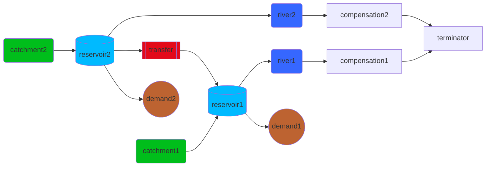

# MOEA optimisation
Pywr can be integrated with different libraries to solve different kinds of optimization problems. This page explains
how to solve a particular type of optimisation problem often encountered in water resource models using [multi-objective
evolutionary algorithms (MOEAs)](https://en.wikipedia.org/wiki/Multi-objective_optimization).

Multi-Objective Evolutionary Algorithms (MOEAs) are a powerful class of optimization techniques 
inspired by Charles Darwin's theory of natural selection. They are specifically designed to solve problems where
two or more conflicting objectives that need to be optimized simultaneously, such as reducing cost and improving water 
resource position. Unlike single-objective optimization, which seeks a single best solution, MOEAs aim to find a
set of equally good "trade-off" solutions.
These algorithms operate on a population of potential solutions. This population is iteratively improved over a
number of generations by applying principles of evolution: selection, crossover, and mutation.

The ultimate goal of an MOEA is to find a set of non-dominated solutions, known as the Pareto front through an iterative process.
This front represents the best possible trade-offs between the conflicting objectives. A decision-maker can then choose a
solution from this front that best fits their specific needs and priorities.

!!!danger "Before going ahead"
    Explaining how the different algorithms work is outside the scope of this manual. Before reading this page, make
    sure you are familiar with the basic concept of multi-objective optimisation and algorithms. 

## Available libraries
Pywr offers integration (called wrappers) with two Python optimisation libraries:

- [Platypus](https://platypus.readthedocs.io/en/latest/)
- [Pygmo](https://esa.github.io/pygmo2/)

These wrappers allow you to set up the optimisation library, in terms of variables and objectives, directly from
your Pywr model. Both libraries offer a comprehensive suite of MOEAs, such as NSGAII and SPEA2.

## Setting up variables
The optimisation variables are set up using one or more [pywr.parameters.Parameter][]. The following parameters 
support variable values:

- [pywr.parameters.ConstantParameter][]
- Profiles: [pywr.parameters.DailyProfileParameter][], [pywr.parameters.MonthlyProfileParameter][] and [pywr.parameters.RbfProfileParameter][]
- Activation functions: [pywr.parameters.BinaryStepParameter][], [pywr.parameters.RectifierParameter][] and [pywr.parameters.LogisticParameter][]
- Control curves: [pywr.parameters.ControlCurveParameter][] and [pywr.parameters.ControlCurveInterpolatedParameter][]

If you want to set a parameter as variable, you can set the `is_variable` parameter to true. For example for a 
[pywr.parameters.ConstantParameter][]:

```json
{
    "type": "ConstantParameter",
    "value": 1.2,
    "is_variable": true
}
```

When you initialise the optimisation wrapper, Pywr will register this variable as real in the optimisation library.
To restrict the range the optimisation algorithm can sample from, you can use the `lower_bounds` and `upper_bounds` parameters:

```json
{
    "type": "ConstantParameter",
    "value": 1.2,
    "is_variable": true,
    "lower_bounds": 0.1,
    "upper_bounds": 10
    
}
```

The optimisation algorithm, based on its own implementation, will then select a number between `0.1` and `10`. If you do not
set any bounds, the lower bound defaults to `0` and the upper bound to infinite. Remember the **definition of the bounds may
vary for a different parameter**; make sure to refer to the [API pages](../api/parameters/simple/constant.md) for a specific
parameter. For example, for a [pywr.parameters.MonthlyProfileParameter][], you introduce 12 variables, and you can set the
same bounds for all variables (with one number) or control the bound on each profile monthly value:

```json
{
    "type": "MonthlyProfileParameter",
    "values": [1, 9, 45, 23, 120, 190, 300, 900, 200, 101, 32, 12],
    "lower_bounds": [0, 0, 1, 2, 2, 5, 5, 10, 7, 4, 3, 0],
    "upper_bounds": 10
}
```


## Setting up objectives
Objectives are set up by configuring recorders. All recorders in Pywr can be set up as objectives by using the
`is_objective` parameter; for example, to maximise the minimum storage of a reservoir node, use:

```json
{
    "type": "MinimumVolumeStorageRecorder",
    "node": "Reservoir",
    "is_objective": "maximise"
}
```

The value of the parameter can be any of the following keywords: `maximize`, `maximise` and `max` for maximisation or
`minimize`, `minimise` and `min` to minimise.

When the optimiser needs to assess the objective values after new individuals
are generated, the wrapper will run the Pywr model and return, for each recorder set as objective, the number
returned by the `aggregated_value()` of the recorder. If you are using scenarios, the function will aggregate all the
results for each scenario using the `agg_func` which defaults to `"mean"`. Some recorders, before aggregating the
scenario values, also aggregated over time. Make sure to check the API page for the recorders you are using so that all
objectives are properly configured.

## Setting up constraints
If you want to register a constraint to the problem, this is done using recorders with `constraint_lower_bounds`
and `constraint_upper_bounds`. The constraint bounds are not used during a model simulation and when at least one is provided,
the recorder property `is_constraint` will return `True`. 

For example, if you want a control curve to be crossed only 20 years over a simulation, you can use:

```json
{
  "parameters": {
    "Line": {
      "type": "MonthlyProfileParameter",
      "values": [0.6, 0.52, 0.5, 0.45, 0.4, 0.35, 0.4, 0.43, 0.51, 0.55, 0.63, 0.6]
    },
    "Crossing": {
        "type": "ControlCurveParameter",
        "storage_node": "Reservoir",
        "control_curves": ["Line"],
        "comment": "This returns 1 if the line is crossed"
    }
  },
  "recorders": {
    "type": "AnnualCountIndexThresholdRecorder",
    "parameters": ["Crossing"],
    "threshold": 1,
    "constraint_upper_bounds": 20,
    "comment": "This counts the number of years the line is crossed"
  }
}
```
The lower bound must be strictly less than the upper bound, and an equality constraint can be created by setting both bounds to the 
same value.

You can also set constraints on an objective by combing `is_objective` and `constraint_*_bounds`:

```json
{
    "type": "MinimumVolumeStorageRecorder",
    "node": "Reservoir",
    "is_objective": "maximise",
    "constraint_lower_bound": 1000
}
```
Bear in ming that some algorithms may raise an error if you set an equality constraints on objectives. 

!!!warning "Unfeasible solution"
    Be mindful of constraints; if you set too many, there may be no solution to the problem you are trying to solve, and
    the MOEA may not be able to find a valid Pareto front. If that is the case, it is a good approach to remove all
    or some of the constraints.


## Example

### Model setup
The following example is taken from the Pywr repository; you can find the JSON document below the schematic and
all the files you need to run the model and the optimiser are available [here](https://github.com/pywr/pywr/tree/master/examples/data).



The model is structured as follows: 

- Both catchments yield the same flow, and the two reservoirs have the same capacity
- However the demand on `"demand1"` is higher than `"demand2"` and `"reservor1"`
cannot meet the full demand on it own when it is dry.
- An expensive transfer link, controlled by a monthly profile, can move water from `"reservor2"`
to  `"reservor1"`.

??? note "Complete model"
    ```json
        {
        "metadata": {
            "title": "Two reservoirs",
            "description": "A simple problem with two reservoirs.",
            "minimum_version": "0.5"
        },
        "timestepper": {
            "start": "2100-01-01",
            "end": "2200-01-01",
            "timestep": 7
        },
        "nodes": [
            {
                "name": "catchment1",
                "type": "catchment",
                "flow": "flow"
            },
            {
                "name": "catchment2",
                "type": "catchment",
                "flow": "flow"
            },
            {
                "name": "reservoir1",
                "type": "storage",
                "min_volume": 0,
                "max_volume": 200,
                "initial_volume": 200,
                "cost": -5
            },
            {
                "name": "reservoir2",
                "type": "storage",
                "min_volume": 0,
                "max_volume": 200,
                "initial_volume": 200,
                "cost": -5
            },
            {
                "name": "transfer",
                "type": "link",
                "cost": -500,
                "max_flow": "transfer_controller"
            },
            {
                "name": "demand1",
                "type": "output",
                "max_flow": 1.8,
                "cost": -101
            },
            {
                "name": "demand2",
                "type": "output",
                "max_flow": 1.0,
                "cost": -100
            },
            {
                "name": "river1",
                "type": "link"
            },
            {
                "name": "river2",
                "type": "link"
            },
            {
                "name": "compensation1",
                "type": "rivergauge",
                "mrf": 0.6,
                "mrf_cost": -1000
            },
            {
                "name": "compensation2",
                "type": "rivergauge",
                "mrf": 0.6,
                "mrf_cost": -1000
            },
            {
                "name": "terminator",
                "type": "output"
            }
    
        ],
        "edges": [
            ["catchment1", "reservoir1"],
            ["catchment2", "reservoir2"],
            ["reservoir1", "river1"],
            ["reservoir2", "river2"],
            ["river1", "compensation1"],
            ["river2", "compensation2"],
            ["compensation1", "terminator"],
            ["compensation2", "terminator"],
            ["reservoir2", "transfer"],
            ["transfer", "reservoir1"],
            ["reservoir1", "demand1"],
            ["reservoir2", "demand2"]
        ],
        "parameters": {
            "flow_factor": {
                "name": "flow_factor",
                "type": "constant",
                "value": 0.0864
            },
            "flow_cumecs": {
                  "type": "dataframe",
                  "url": "thames_stochastic_flow.gz",
                  "column": "flow",
                  "index_col": "Date",
                  "parse_dates": true
            },
            "flow": {
                "type": "aggregated",
                "agg_func": "product",
                "parameters": ["flow_cumecs", "flow_factor"]
            },
            "control_curve": {
                "type": "monthlyprofile",
                "values": [0, 0, 0, 0, 0, 0, 0, 0, 0, 0, 0, 0],
                "is_variable": true,
                "upper_bounds": 1.0
            },
            "transfer_controller": {
                "type": "controlcurve",
                "storage_node": "reservoir1",
                "control_curve": "control_curve",
                "values": [0.0, 1.0]
            }
        },
        "recorders": {
            "deficit1": {
                "type": "DeficitFrequencyNode",
                "node": "demand1"
            },
            "deficit2": {
                "type": "DeficitFrequencyNode",
                "node": "demand2"
            },
            "deficit": {
                "type": "aggregated",
                "recorders": ["deficit1", "deficit2"],
                "recorder_agg_func": "sum",
                "is_objective": "minimise"
            },
            "transferred": {
                "type": "totalflownode",
                "node": "transfer",
                "is_objective": "minimise"
            }
        }
    }
    ```

### Optimiser setup
The model will set up the optimiser as follows:

- **Objectives**: minimise the deficit of the demand centres and minimise the operational costs of the transfer.
This is achieved by setting `is_objective` to `minimise` in:
    -  the `deficit` recorder which records the total frequency of not meeting demand for the two demand centres.
    - the `transferred` recorder which records the total flow delivered by the `transfer` node.
- **Variables**: the 12 points of the monthly profile control curve. The profile is made variable by setting
`is_variable` to `true`. An upper bound is also added to the variable to prevent the algorithm to sample values above 1.
The profile is set to zero as it will be changed by the MOEA.

The problem contains two conflicting objectives, and the algorithm will provide a Pareto front of
solutions. To assess the objectives, the wrapper will run the model for 100 years with a 7-day timestep
for each individual whose fitness needs to be evaluated.

### Run the optimiser (Platypus)
The following section shows how to start the optimiser using the Pywr wrapper with the
Playpus library. A complete example of this problem using both the Pygmo and Platypus packages
is available in the [Pywr repository](https://github.com/pywr/pywr/blob/master/examples/two_reservoir/two_reservoir_moea.py).

!!!warning "Dependencies"
    Make sure to install `platypus-opt` before running the script below.

```python
import platypus
import pandas as pd
import numpy as np
from pywr.optimisation.platypus import PlatypusWrapper
import logging

if __name__ == "__main__":
    # Setup logging
    logger = logging.getLogger("pywr")
    logger.setLevel(logging.INFO)
    ch = logging.StreamHandler()
    formatter = logging.Formatter(
        "%(asctime)s - %(name)s - %(levelname)s - %(message)s"
    )
    ch.setFormatter(formatter)
    logger.addHandler(ch)

    # Pass the model to the Pywr wrapper
    wrapper = PlatypusWrapper("two_reservoir.json")

    # Start the genetic algorithm
    with platypus.ProcessPoolEvaluator(10) as evaluator:
        algorithm = platypus.NSGAII(
            problem=wrapper.problem, 
            population_size=50, 
            evaluator=evaluator
        )
        algorithm.run(10000)

    objectives = pd.DataFrame(
        data=np.array([s.objectives for s in algorithm.result]),
        columns=[o.name for o in wrapper.model_objectives],
    )
    objectives.to_hdf("two_reservoir_moea.h5")
```

The code above:

- L20 initialises the `PlatypusWrapper` class. This accepts the pywr model dictionary.
- L23 creates a [context manager](https://www.geeksforgeeks.org/python/context-manager-in-python/) and
initialises the Platpyus's pool class to run 10 processes in parallel. Each process will run one Pywr
model with one individual (one set of 12 variables) and evaluate the objectives
- L24 initialises the genetic algorithm of choice (NSGA2) with the problem (which contains the variables,
constraints and objectives), the number of individuals (50 potential points in the Pareto front) and the parallel evaluator.
- L29 runs the parallel processes and stops the genetic algorithm when 10,000 function evaluations
(i.e., the number of times an individual's objectives are evaluated) are reached.
- L31 to 35 saves the objectives in an HDF file.


### Additional model options
The wrapper calls `Model.load()` to initialise the model. You can pass additional options to
the function by using the `model_kwargs` parameter:

```python
wrapper = PlatypusWrapper(
    pywr_model_json=model_data, 
    model_kwargs={"path": "/data/path"}
)
```

### Plot the Pareto front
To plot the Pareto front, you can load the HDF file and use a scatter plot: 

```python
import pandas as pd
import matplotlib.pyplot as plt
import seaborn as sns

store = pd.HDFStore("two_reservoir_moea.h5")

fig, ax = plt.subplots(figsize=(6, 6))
colors = sns.color_palette()

for color, key in zip(colors, store.keys()):
    df = store[key]
    label = key.replace("/", "").replace("_", " ").capitalize()
    df.plot.scatter(ax=ax, x="deficit", y="transferred", label=label, color=color)

ax.set_xlabel("Total deficit [$Mm^3$]")
ax.set_ylabel("Total transfer [$Mm^3$]")
ax.grid()
fig.savefig("two_reservoir_pareto.png")
```

### Restart from a previous evolution
You can load existing solutions (if coming from a previous optimisation) into the wrapper instead of generating random variables
when you start the optimisation. First, you need to build a list (L5-22 below) where each item represents a 
solution. A solution is described using a dictionary where the keys are the names of
variable parameters (`"control_curve"` in the example above). The values must
be a dictionary with two keys: `"doubles"` if the parameter handles real variables and 
`"integers"` if the parameter handles integer variables:

```python
import numpy as np
import platypus
from pywr.optimisation.platypus import PlatypusWrapper, PywrRandomGenerator

current_solutions = [
    {
        "control_curve": {
            "doubles": np.array(
                [0.6, 0.52, 0.5, 0.45, 0.4, 0.35, 0.4, 0.43, 0.51, 0.55, 0.63, 0.6]
            ),
            "integers": np.array([]),
        }
    },
    {
        "control_curve": {
            "doubles": np.array(
                [0.8, 0.73, 0.7, 0.62, 0.6, 0.55, 0.6, 0.65, 0.72, 0.75, 0.83, 0.8]
            ),
            "integers": np.array([]),
        }
    },
]

wrapper = PlatypusWrapper(pywr_model_json="model.json")
generator = PywrRandomGenerator(
    wrapper=wrapper,
    solutions=current_solutions,
    use_current=False
)

with platypus.ProcessPoolEvaluator(10) as evaluator:
    algorithm = platypus.NSGAII(
        problem=wrapper.problem, 
        population_size=50, 
        evaluator=evaluator,
        generator=generator
    )
    algorithm.run(10000)
```

The nested dictionaries contain numpy arrays of length equal to the number of variables for the parameter.
The code above shows an example with two solutions and 12 values for the monthly profile. The array
with the integer values is empty because the `ControlCurveParameter` only handles real numbers and can be omitted.

The solution list is then given to the `PywrRandomGenerator` using the `solutions` and `use_current` 
parameters to create an instance of `platypus.RandomGenerator`. This can then be passed
to the platypus algorithm using the `generator` parameter.

## Some tips
### Convergence time
The algorithm will converge faster if the number of processes matches the population size (i.e., the more core
your machine can support, the better). In the example above, the algorithm can only use 10 processes, and if it needs to
evaluate 50 new individuals, it would roughly take 5 times as long if you had 50 processes. 
This also depends on the number of new individuals that need to be evaluated, the algorithm implementation
and the problem definition.

### Stopping condition
The termination condition determines when the algorithm should stop evolving the population.
Make sure you set a proper number and that the algorithm properly converges by exporting
partial solutions and/or assessing a [convergence metric](https://pymoo.org/misc/indicators.html).

### Export solutions
Platypus stores the individual's data at the last generation in the [Solution](https://platypus.readthedocs.io/en/latest/api/platypus.core.html#platypus.core.Solution)
class. To access the population data, you can use something like:

```python
# to access the 50 individuals (with 12 point each)
variables = [list(s.variables) for s in algorithm.result]

objectives = [list(s.objectives) for s in algorithm.result]
constraints = [list(s.constraints) for s in algorithm.result]
constraint_violation = [list(s.constraints) for s in algorithm.result]
```

Some algorithms also support a `callback` option, you can use to export the
solutions and other data while the algorithm is running, for example, to assess
the [Hypervolume or other convergence indicators](https://pymoo.org/misc/indicators.html).
